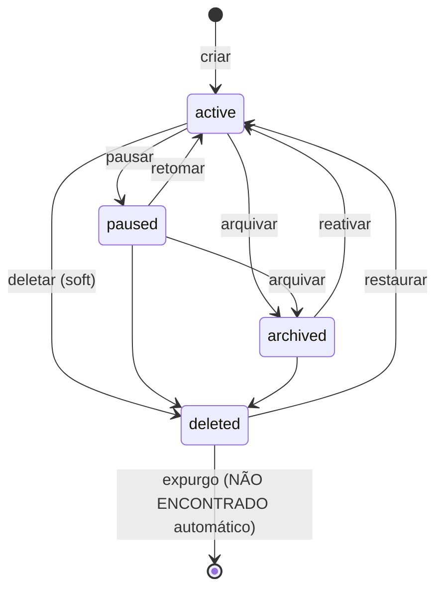
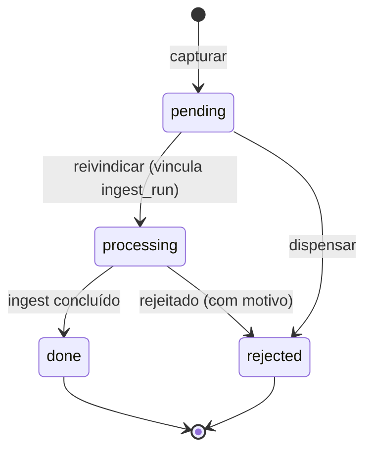
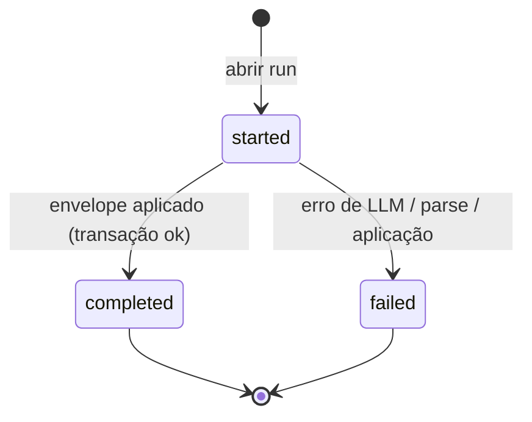
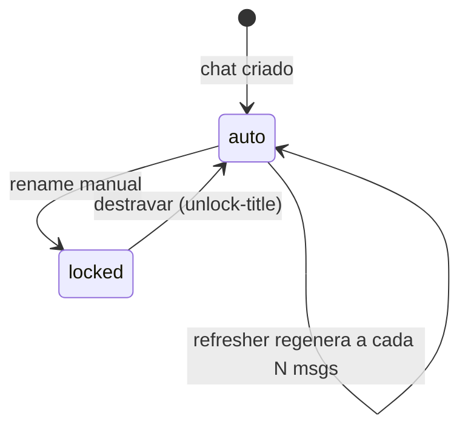

# Kura — Camada funcional (agnóstica de tecnologia)

> Descreve **comportamento e regras**, não implementação. Onde uma regra está acoplada ao stack, foi extraída
> a **intenção**. Suposições marcadas com **[INFERIDO]**; ausência de evidência com **NÃO ENCONTRADO**.
> Cada regra de negócio cita arquivo/função de origem. Base factual: `spec/01-reconhecimento.md`.
> Cobertura: os 3 subsistemas com peso igual (Collector/Teams, App SPA, Vault).

---

## 1. VISÃO GERAL

- **Propósito.** "Segundo cérebro" pessoal que **captura, resume e consulta conhecimento** — em especial
  conversas do Microsoft Teams — e mantém uma **wiki pessoal evoluída incrementalmente por um LLM**.
  (`README.md`; `kura/vault/ask.py:1-24`).
- **Usuário-alvo.** Um único usuário técnico, trabalhando localmente na própria máquina, em **ambiente
  corporativo restrito** (inspeção de SSL, acesso condicional, repositórios de pacotes bloqueados).
  O acesso a LLM é por uma ferramenta de linha de comando local, sem chave de API. (`kura/llm/client.py`;
  `spec/01-reconhecimento.md` §F).
- **Problema resolvido.** Conhecimento de trabalho fica disperso em conversas efêmeras e documentos soltos.
  Kura (a) coleta e arquiva as conversas, (b) gera resumos diários, (c) oferece um chat assistido por IA com
  contexto de projetos/arquivos, e (d) consolida tudo numa base de conhecimento pesquisável com citações —
  **sem enviar dados a serviços de terceiros** (local-first). (`README.md`; `kura/summarize.py`;
  `kura/vault/*`).
- **Três subsistemas frouxamente acoplados.**
  - **Collector/Summarizer** — coleta o Teams para Markdown e gera resumo diário (`kura/teams/*`,
    `kura/summarize.py`).
  - **App SPA** — interface de chat + workspaces (pre-projects/projects) + fila + dashboard (`kura/app_server.py`,
    `templates/*`).
  - **Vault** — wiki mantida por LLM, fonte da verdade em banco local com busca textual (`kura/vault/*`).

---

## 2. FEATURES

> `nome | descrição | gatilho | resultado | arquivos de origem`

### Collector / Summarizer

| Nome | Descrição | Gatilho | Resultado | Arquivos |
|---|---|---|---|---|
| Coleta Teams (API) | Coleta incremental de chats/canais via API corporativa, usando cursor de delta | Loop do daemon ou ciclo único; backend = API | Conversas anexadas a arquivos Markdown por grupo/dia | `kura/teams/collector.py`, `kura/teams/graph_client.py` |
| Coleta Teams (navegador) | Alternativa por scraping do Teams web num navegador dedicado, para quando a API é bloqueada | Idem, backend = web | Mesmos arquivos Markdown | `kura/teams/web_collector.py`, `kura/teams/scrape.js` |
| Login | Autenticação interativa Microsoft (fluxo device-code) | Comando `auth login` | Token em cache local | `kura/teams/auth.py` |
| Verificar ambiente | Checagem de SSL, token, presença da CLI de LLM e libs opcionais | `verify` / `installer doctor` | Relatório no terminal | `kura/installer/doctor.py` |
| Resumo diário | Resumo por grupo + resumo executivo cruzando grupos | `summarize` / pipeline | Arquivos de resumo + dashboard | `kura/summarize.py` |

### App SPA

| Nome | Descrição | Gatilho | Resultado | Arquivos |
|---|---|---|---|---|
| Chat persistente | Conversa com histórico, streaming, anexos, troca de modelo | UI nova/abrir chat; `POST /api/chats/.../messages/stream` | Chat salvo em disco | `kura/chat_store.py`, `kura/devin_chat.py` |
| Chat anônimo | Conversa temporária, sem persistência no servidor | `POST /api/anon/messages/stream` | Nada persistido | `kura/chat_store.py:20-27` |
| Título automático | Geração/atualização de título por LLM, exceto se travado por rename manual | A cada N mensagens; `refresh-title` | `title` do chat atualizado | `kura/title_refresher.py`, `chat_store.py:464-490` |
| Upload de anexo | Anexa arquivo, extrai texto e inlina no prompt | `POST /api/chats/{id}/upload` | Arquivo salvo + texto extraído | `kura/text_extract.py`, `chat_store.py:637-663` |
| Salvar no vault | Promove uma conversa para captura/ingest na wiki | `POST /api/chats/{id}/save-to-vault` | Captura criada | `kura/app_server.py` (`h_chat_save_to_vault`) |
| Pre-projects | Workspace com chats + arquivos + instruções + consulta-vault opcional | `/api/pre-projects/*` | Diretório de workspace | `kura/pre_project_store.py` |
| Projects (mini-vault) | Projeto com ciclo de vida, docs, páginas próprias e promoção ao vault | `/api/projects/*` | Diretório de projeto | `kura/projects/*` |
| Queue | Fila de arquivos parseados e ingeridos, com deduplicação | `POST /api/queue/process` | Arquivos movidos p/ processados/falhos | `kura/queue/pipeline.py` |
| Dashboard | Navegação por dia dos resumos | `/api/dashboard/*` | Dados estruturados do dia | `kura/dashboard_data.py` |
| Setup wizard | Primeira execução: vault, backend, idioma, agente de background | `/api/setup/*` | Config gravada | `kura/installer/setup.py` |
| Upgrade in-app | Sobe pacote mais novo; valida, faz backup, troca, reinicia, rollback | `/api/upgrade/*` | Código atualizado | `kura/installer/upgrade.py` |
| Settings | Idioma + preferências de UI | `POST /api/settings/language` | Persistência de preferência | `kura/app_server.py:4481`, `kura/i18n.py` |
| Busca global | Busca unificada em vault + arquivos de pre-projects + docs de projects | `GET /api/search` | Lista de resultados | `kura/app_server.py` (`h_search`) |

### Vault

| Nome | Descrição | Gatilho | Resultado | Arquivos |
|---|---|---|---|---|
| Init/reset | Cria estrutura + banco da wiki | `vault init`; `POST /api/vault/init` | Banco + diretório criados | `kura/vault/db.py`, `kura/vault/init.py` |
| Ingest | Lê uma fonte, chama LLM e aplica páginas + exporta snapshot | `vault ingest`; `POST /api/vault/ingest` | Páginas criadas/atualizadas | `kura/vault/ingest.py` |
| Ingest "discutir antes" | Fase 1 propõe (sem escrever); Fase 2 aplica com notas do usuário | `vault ingest --discuss`; `POST /api/vault/discuss[+/apply]` | Proposta salva, depois páginas | `kura/vault/discuss.py` |
| Ask (perguntar) | Responde uma pergunta usando busca textual + leitura inline, com citações | `vault ask`; `POST /api/vault/ask` | Resposta com citações; opcional salvar | `kura/vault/ask.py` |
| Web gap-fill | Quando a pergunta vem "fria", busca a web e re-ingere | `--web` + flag habilitada | Páginas de origem web | `kura/vault/web_gap_fill.py` |
| Lint | Corrige/relata problemas mecânicos das páginas | `vault lint`; `POST /api/vault/lint` | Issues + auto-fixes | `kura/vault/lint.py` |
| Consolidate | Propõe e aplica fusões/reorganizações | `/api/vault/consolidate/*` | Páginas reorganizadas | `kura/vault/consolidate.py` |
| Inbox | Itens candidatos a ingest, com dispensar | `/api/vault/inbox*` | Lista de candidatos | `kura/app_server.py` (`h_vault_inbox*`) |
| Auto-ingest watcher | Vigia diretórios e ingere automaticamente | flag de watch | Ingest contínuo | `kura/vault/watcher.py`, `kura/vault/watch.py` |
| Export / Health / Stats / Graph / Backlinks / Issues | Manutenção e visualização | endpoints `/api/vault/*` | Dados/arquivos correspondentes | `kura/vault/export.py`, `kura/vault/db.py` |
| Bootstrap-teams | Consolida resumos do collector no vault | `vault bootstrap-teams` | Páginas a partir de resumos | `kura/vault/bootstrap.py` |

---

## 3. FLUXOS DE USUÁRIO

### 3.1 Primeira execução (setup)
Telas/endpoints: `#/setup` · `GET /api/setup/state` · `POST /api/setup/apply` · `POST /api/setup/skip`.
1. App inicia e detecta install não inicializado → roteia para o wizard.
2. Usuário escolhe local do vault, backend de coleta, idioma, janela inicial de coleta e se instala o agente
   de background.
3. Aplicar grava a configuração e inicializa o vault.
- **Erro de escrita** (sem permissão no diretório do vault): mostra erro e permanece no wizard. [INFERIDO da
  validação de path]
- **Pular**: marca como concluído sem coletar.

### 3.2 Conversar (chat persistente)
Telas/endpoints: `#/new`, `#/c/<id>` · `POST /api/chats` · `POST /api/chats/{id}/messages/stream`.
1. Usuário digita e envia; o app cria o chat (se novo) e abre o stream.
2. O servidor monta o prompt (histórico + instruções do escopo + contexto do vault se habilitado) e
   transmite a resposta em incrementos.
3. Após as primeiras trocas, o título é gerado por LLM se não estiver travado.
- **Erro do LLM** (timeout/saída≠0): erro exibido sem expor detalhes internos. (`kura/app_server.py:599-614`).
- **Concorrência por abas**: vários chats podem transmitir ao mesmo tempo (guarda por conjunto de chats em
  envio). [INFERIDO — `templates/spa/04_state.js`]
- **Rename manual**: trava o título; "destravar" reativa a geração automática. (`chat_store.py:464-490`).

### 3.3 Chat anônimo
Telas/endpoints: `#/anon` · `POST /api/anon/messages/stream`.
1. Cada envio manda o histórico inteiro no corpo da requisição.
2. O servidor não persiste nada; atualizar/fechar/navegar destrói a conversa. (`chat_store.py:20-27`).

### 3.4 Pre-project / Project
Telas/endpoints: `#/pre-projects`, `#/projects` · `/api/pre-projects/*`, `/api/projects/*`.
1. Criar workspace → nome vira identificador-slug.
   - **Colisão de slug**: recusa com conflito (mapeado a 409). (`kura/projects/schema.py:51-58`).
2. Anexar arquivos (texto extraído uma vez), definir instruções e a opção de consultar o vault.
3. Chats criados no escopo ficam ocultos da barra lateral principal e visíveis só na página do escopo.
   (`chat_store.py:533-594`).
4. **Deletar pre-project/project**: os chats **não são perdidos** — voltam a ser livres (free-standing).
   (`chat_store.py:596-623`).
5. **Promover**: pre-project → project; página/projeto → vault.

### 3.5 Fila (queue)
Telas/endpoints: `#/queue` · `POST /api/queue/process`.
1. Usuário solta arquivos na caixa de entrada da fila; processa todos.
2. Por arquivo: hash → dedup → parser por extensão → ingest no vault → mover para "processados".
   (`kura/queue/pipeline.py:75-123`).
- **Duplicata** (hash já visto): move para processados marcando duplicata. (`pipeline.py:119-120`).
- **Sem parser / mídia não suportada / erro de parse**: move para "falhos" + arquivo de erro lateral.
  (`pipeline.py:131-140`). [INFERIDO do fluxo de falha]
- **Subdiretórios**: ignorados com aviso — a fila é **não-recursiva**. (`pipeline.py:86-111`).
- **Concorrência**: duas execuções simultâneas → a segunda falha (trava exclusiva). (`pipeline.py:15-19`).

### 3.6 Vault — perguntar (ask)
Telas/endpoints: `vault ask` · `POST /api/vault/ask`.
1. Extrai termos de sinal da pergunta → busca textual → seleciona até 7 candidatos → lê o conteúdo inline.
   (`kura/vault/ask.py:53-56`).
2. LLM responde com citações; afirmações fora do vault são marcadas como "vindas do treino, não do vault".
   (`ask.py:15-18`).
- **Resultado frio (0 candidatos)**: marca `cold`; com a opção web habilitada, dispara o gap-fill e re-busca.
  (`ask.py:69-79`).
- **Salvar**: arquiva a resposta como uma página de consulta no vault. (`ask.py:20-23`).

### 3.7 Vault — ingest "discutir antes de escrever"
Telas/endpoints: `vault ingest --discuss` · `POST /api/vault/discuss` · `POST /api/vault/discuss/{id}/apply`.
1. **Fase 1**: o LLM propõe (resumo, páginas propostas, anomalias, perguntas) e a proposta é salva — **nada é
   escrito** no banco. (`kura/vault/discuss.py`).
2. **Fase 2**: com as notas do usuário, aplica o "envelope" de páginas (mesma transação do ingest direto).

### 3.8 Coleta do Teams (ciclo)
Processo: daemon/ciclo único.
1. Lista chats e canais (tolera falha → lista vazia, conta erro). (`collector.py:55-67`).
2. Aplica a janela inicial de coleta (se configurada) **por chat**. (`collector.py:69-94`).
3. Para cada escopo: usa cursor de delta se houver, senão faz backfill da janela padrão; anexa as mensagens
   normalizadas ao arquivo do grupo. (`collector.py:138-210`).
- **Canais**: além dos posts, busca respostas separadamente quando o post tem respostas. (`collector.py:171-207`).
- **Falha de um escopo**: registra aviso, conta erro e segue para o próximo. (`collector.py:105-119`).

### 3.9 Upgrade
Telas/endpoints: `#/settings/upgrade` · `POST /api/upgrade/upload|apply|rollback`.
1. Usuário sobe um pacote mais novo; valida o manifesto, faz backup, troca o código e reinicia.
2. **Falha**: rollback automático para o backup. (`kura/installer/upgrade.py`).

---

## 4. REGRAS DE NEGÓCIO

> Validações, defaults, limites e cálculos não-óbvios, com citação.

### Chat / escopo / título
- **Escopo mutuamente exclusivo.** Um chat é livre OU de 1 pre-project OU de 1 project — nunca mais de um.
  A localização em disco é a fonte da verdade; os ids de escopo são denormalizados e re-derivados ao salvar.
  (`kura/chat_store.py:1-18, 91-101`).
- **Detach seguro ao deletar escopo.** Deletar um pre-project/project move os chats de volta para livres em
  vez de apagá-los. (`chat_store.py:596-623`).
- **Título automático.** Gerado a partir da 1ª mensagem do usuário: máx. **6 palavras**, corta em **60
  caracteres**, remove marcação; vazio → "Novo chat". (`chat_store.py:180-194`).
- **Título travado.** Rename manual trava o título (`title_locked=True`) para o refresher não sobrescrever;
  "destravar" zera o contador para forçar regeneração. (`chat_store.py:464-490`).
- **Unicidade global de título.** Colisão recebe sufixo `(2)`, `(3)`… considerando **todos** os escopos
  (regra global, não por escopo); renomear para o mesmo texto é no-op. (`chat_store.py:492-524`).
- **Sanitização de anexo.** Nome de arquivo é limpo (sem componentes de path) e prefixado por id único para
  evitar colisão. (`chat_store.py:647-650`).
- **Limite de bytes inlinados.** Anexos de pre-project são limitados a **200.000 bytes** por prompt.
  (`kura/devin_chat.py:43`).

### Collector
- **Backend válido.** Apenas dois valores aceitos; qualquer outro causa erro na carga da config.
  (`kura/config.py:292-296`).
- **Janela inicial de coleta.** Vazio/"all"/0 → sem filtro; inteiro 1..3650 → pula **chats** sem atividade
  recente; valor inválido → ignora com aviso (não desativa silenciosamente a coleta). É **por chat**; chats
  sem data de atividade conhecida são **incluídos**; **canais não são filtrados**. (`config.py:322-340`,
  `collector.py:69-94`).
- **Backfill.** Sem cursor de delta salvo, coleta as mensagens das últimas N horas (default 24); com cursor,
  usa o delta. (`collector.py:133-145`).
- **Respostas de canal.** O delta não traz respostas; quando um post tem respostas, elas são buscadas à parte
  e marcadas como resposta. (`collector.py:171-207`).
- **Escopos de API.** Conjunto default de permissões de leitura; a permissão de acesso offline é **sempre
  forçada**. (`config.py:282-288`).

### Vault
- **Curto-circuito por hash (ingest).** Se a fonte já foi ingerida com o mesmo hash de conteúdo, **pula**
  (skip) sem reprocessar. (`kura/vault/ingest.py:112-117, 536-542`).
- **Limite de candidatos (ask).** No máximo **7** candidatos lidos inline; o padrão canônico ramificaria em
  5/6 para subagente, mas como a CLI de LLM não expõe subagente, trunca em 7. (`ask.py:53-56`).
- **Marcação de origem.** Afirmações não cobertas pelo vault são explicitamente rotuladas como vindas do
  treino do modelo. (`ask.py:15-18`).
- **Banco é a fonte da verdade.** O Markdown é um snapshot exportável; a base relacional + busca textual são
  autoritativas. (`kura/vault/db.py:18-30`). Integridade relacional ligada (chaves estrangeiras),
  durabilidade em modo WAL. (`db.py:314-320`).

### Queue
- **Dedup por hash de conteúdo.** Index de hashes vistos é atualizado a cada ingest, então duplicatas
  **dentro do mesmo lote** também deduplicam. (`pipeline.py:96-123`).
- **Não-recursiva.** Apenas arquivos de topo da caixa de entrada são processados. (`pipeline.py:86-111`).
- **Lock exclusivo.** Execuções concorrentes na mesma fila são bloqueadas (segunda falha). (`pipeline.py:15-19`).

### Projects / pre-projects
- **Slug/id.** Deve casar `^[a-z0-9][a-z0-9-]*$`; ids hexadecimais antigos continuam válidos (subconjunto).
  Nome obrigatório e não-vazio. (`kura/projects/schema.py:79, 120-149`).
- **Status válido.** Um de `active|paused|archived|deleted`; valor fora do conjunto é rejeitado.
  (`schema.py:67-72, 127-130`).
- **Colisão de slug.** Criar/renomear com slug existente é recusado (mapeado a conflito 409).
  (`schema.py:51-58`).
- **Tipos estritos.** `consult_vault`/`favorite` devem ser booleanos, `tags` lista de strings; timestamps
  são autopreenchidos. (`schema.py:131-149`).

### Roteamento de modelo (LLM)
- **Default por tarefa.** Tarefas interativas (chat/título/tag) → modelo rápido; análise/RAG/resumos →
  modelo equilibrado; ingest/consolidate/lint/rewrite → modelo de alta capacidade. (`kura/llm/router.py:38-55`).
- **Prioridade de resolução.** override explícito > variável por tarefa > default da tabela > default global >
  nenhum (deixa a CLI decidir). (`router.py:20-27, 58-73`).

### Servidor / operação
- **Substituição de processo na porta.** Só encerra um processo que comprovadamente seja o próprio app;
  processo desconhecido sem evidência → **recusa** (a menos de override explícito). (`app_server.py:5870-5890`).
- **Erros sem vazamento.** Respostas de erro são genéricas, sem expor stack/paths. (`app_server.py:599-614`).
- **Idioma em runtime.** É a única preferência gravada em runtime na config; demais chaves são preservadas.
  (`app_server.py:4481-4515`).

---

## 5. ESTADOS & CICLOS DE VIDA

### 5.1 Project (status)
Valores: `active | paused | archived | deleted` (deleted = soft-delete sob `.trash/`, restaurável).
(`kura/projects/schema.py:67-72`; endpoints `PATCH .../status`, `POST .../restore`).

> Transições governadas por módulo de lifecycle (`schema.py:65-66` menciona `kura.projects.lifecycle`).
> O conjunto exato de transições permitidas: **[INFERIDO]** a partir da semântica dos estados; a regra
> formal de quais pares são válidos **NÃO ENCONTRADO** explicitamente nos arquivos lidos.

### 5.2 Capture (ingest do vault)
Valores: `pending | processing | done | rejected` (com `rejected_reason`). (`kura/vault/db.py:165-166`).

### 5.3 Ingest run
Valores: `started | completed | failed` (+ `exit_code`, `pages_touched`, `latency_ms`). (`db.py:177`;
`kura/vault/ingest.py:8-15`).

### 5.4 Issue (problemas reportados)
Campos de severidade `info|warn|error` e flag `resolved` (+ `resolved_at`, `resolved_by`). (`db.py:186+`).
Ciclo: `aberta (resolved=0) → resolvida (resolved=1)`.

### 5.5 Chat (título)
Dois eixos: conteúdo (cresce com mensagens) e título (`auto` ↔ `locked`).

(`kura/chat_store.py:464-490`).

### 5.6 Fila (por arquivo)
Resultado terminal por arquivo: `ingested | duplicate | failed`. (`kura/queue/pipeline.py:116-122`).
Em disco: `inbox → processed` (ingested/duplicate) ou `inbox → failed` (+ arquivo de erro).

### 5.7 Setup / Upgrade
- **Setup**: `não-inicializado → inicializado` (via apply) ou `pulado`. [INFERIDO dos endpoints
  `setup/state|apply|skip`].
- **Upgrade**: `upload → validado → backup → aplicado → reiniciado`; em falha, `rollback`. (`installer/upgrade.py`).

---

## 6. PERMISSÕES

- **Modelo single-user, local-first.** A API HTTP escuta apenas em loopback (`127.0.0.1`) e **não possui
  login, sessão, papéis ou autorização**. O modelo de confiança assume um único usuário local dono da máquina.
  (`spec/01-reconhecimento.md` §C/§E; ausência de rotas de auth em `kura/app_server.py::ROUTES`).
- **Papéis/RBAC.** **NÃO ENCONTRADO** — não há conceito de usuários múltiplos, grupos ou níveis de acesso.
- **O que delimita ações (em vez de papéis):**
  - **Bind em loopback** restringe o acesso à própria máquina. [INFERIDO da política local-first]
  - **Overrides operacionais por variável de ambiente** funcionam como "consentimento explícito" para ações
    sensíveis — ex.: forçar substituição de processo na porta. (`app_server.py:5876`).
  - **Funcionalidades de rede opcionais e desligadas por padrão** — busca web (gap-fill) só roda com flag
    habilitada e sujeita a lista de domínios permitidos. (`kura/config.py:390-398`).
- **Credenciais externas.** O acesso ao Teams usa identidade do próprio usuário (device-code / sessão do
  navegador dedicado); o acesso a LLM usa a configuração local da CLib de IA — **sem chaves geridas pelo app**.
  (`kura/teams/auth.py`, `kura/llm/client.py`).

---

## Itens NÃO ENCONTRADOS / INFERIDOS (resumo)
- Conjunto formal de transições permitidas entre status de project — **[INFERIDO]** pela semântica;
  regra explícita **NÃO ENCONTRADA** nos arquivos lidos (referencia `kura.projects.lifecycle`).
- Expurgo automático de projects soft-deleted — **NÃO ENCONTRADO**.
- Detalhes de erro do setup (mensagens específicas por falha) — **[INFERIDO]**.
- Qualquer modelo de papéis/autorização — **NÃO ENCONTRADO** (single-user por design).
