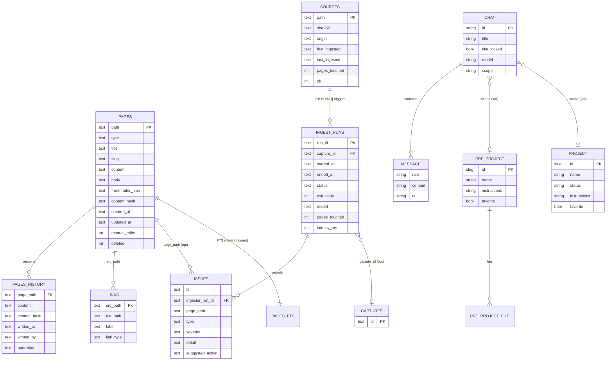

# Kura — Camada Técnica (Spec de Reimplementação)

> Documento técnico **agnóstico de stack** extraído por engenharia reversa do
> repositório `kura` (v0.4.0). Complementa `spec/01-reconhecimento.md` (fatos) e
> `spec/02-funcional.md` (comportamento). O objetivo é permitir reimplementar o
> sistema em qualquer linguagem/framework sem perder contratos, formatos e
> regras.
>
> **Convenções deste documento:**
> - `arquivo:linha` — citação verificada no código-fonte.
> - **[INFERIDO]** — dedução do autor, não literal no código.
> - **[NÃO ENCONTRADO]** — buscado mas ausente no momento da extração.
> - Pseudo-schemas usam notação neutra (`tipo`, `?` = opcional). Nenhum framework
>   específico é assumido.
> - Segredos (tokens, credenciais) **nunca** aparecem; apenas nomes e mecanismos.

---

## 1. MODELO DE DADOS

Kura persiste estado em **quatro substratos distintos**, cada um com seu próprio
modelo:

| Substrato | Tecnologia atual | Conteúdo | Citação |
|---|---|---|---|
| Vault DB | SQLite + FTS5 | Wiki versionada, fontes, runs, issues, auditoria LLM | `kura/vault/db.py:60-299` |
| Chats | Arquivos JSON | Conversas (mensagens, anexos, escopo) | `kura/chat_store.py:1-200` |
| Pré-Projetos | JSON (`pre_project.json`) | Workspaces estilo ChatGPT | `kura/pre_project_store.py` |
| Projetos | YAML (`project.yaml`) | Mini-vaults com docs + páginas | `kura/projects/schema.py:1-160` |
| Auditoria LLM | JSONL append-only | Toda chamada ao subprocesso LLM | `kura/llm/client.py` |
| Fila | Diretórios + JSONL log | Inbox drop-zone / processed / failed | `kura/queue/pipeline.py:1-140` |

> A escolha de SQLite é detalhe de implementação. O modelo relacional abaixo é o
> contrato; uma reimplementação pode usar qualquer engine que preserve as
> entidades, chaves e a busca full-text.

### 1.1 Vault DB — entidades

Schema **v1** declarado em `kura/vault/db.py:60-299`. PRAGMAs de durabilidade e
integridade referencial habilitados (`foreign_keys=ON`, journuling WAL) —
`kura/vault/db.py` (seção de PRAGMA).

#### `pages` — página viva da wiki

| Campo | Tipo | Significado | Chave |
|---|---|---|---|
| `path` | texto | Caminho vault-relativo, sempre inicia em `wiki/` e termina em `.md` | **PK** |
| `type` | texto | Categoria semântica (`concept`, `entity`, `analysis`, `query`…) extraída do frontmatter | |
| `title` | texto | Título legível | |
| `slug` | texto | Slug derivado | |
| `content` | texto | Markdown completo (frontmatter + corpo) | |
| `body` | texto | Apenas o corpo (sem frontmatter) | |
| `frontmatter` | texto (JSON) | Frontmatter serializado | |
| `content_hash` | texto | sha256 do `content` — usado para short-circuit e `previous_hash` | |
| `created_at` | texto (ISO-8601 UTC) | Timestamp de criação | |
| `updated_at` | texto (ISO-8601 UTC) | Última modificação | |
| `manual_edits` | inteiro (0/1) | Marca edição humana direta (vs LLM) | |
| `deleted` | inteiro (0/1) | Soft-delete | |

Citação: estrutura de INSERT/UPDATE em `kura/vault/ingest.py:471-507`.

#### `pages_history` — versionamento append-only

| Campo | Tipo | Significado |
|---|---|---|
| `page_path` | texto | FK → `pages.path` |
| `content` | texto | Snapshot do markdown naquela versão |
| `content_hash` | texto | sha256 do snapshot |
| `written_at` | texto (ISO-8601) | Quando |
| `written_by` | texto | Autor: `llm:<model>` ou `manual` / `human` |
| `operation` | texto | `create` \| `update` |

Citação: `kura/vault/ingest.py:510-517`. Toda escrita registra histórico **mesmo
quando o conteúdo não muda** — preserva a intenção do LLM
(`kura/vault/ingest.py:486-492`).

#### `pages_fts` — índice full-text (FTS5)

Tabela virtual FTS5 espelhando `pages` (colunas indexadas: título/corpo).
Tokenizer **`unicode61 remove_diacritics 2`** — busca insensível a acentos
(`kura/vault/ingest.py:396-401`). Mantida sincronizada via **triggers** de
`INSERT`/`UPDATE`/`DELETE` sobre `pages` — `kura/vault/db.py:60-299`.

> **[INFERIDO]** Em uma reimplementação sem FTS5, o contrato equivalente é:
> índice de texto com normalização de diacríticos e operadores `OR`/frase. As
> queries são montadas como `"termo" OR "termo"` com aspas para neutralizar
> palavras reservadas (`kura/vault/ingest.py:373-393`).

#### `links` — grafo de cross-links

| Campo | Tipo | Significado |
|---|---|---|
| `src_path` | texto | Página origem (FK → `pages.path`) |
| `dst_path` | texto | Página destino, normalizada para iniciar em `wiki/` |
| `label` | texto? | Rótulo do link |
| `link_type` | texto | Tipo do link (ex: wikilink, ref) |

Reconstruído integralmente a cada escrita de página (`DELETE` + `INSERT OR
IGNORE`) — `kura/vault/ingest.py:520-532`.

#### `sources` — proveniência de ingestão

| Campo | Tipo | Significado | Chave |
|---|---|---|---|
| `path` | texto | Caminho da fonte (vault-relativo ou absoluto) | **PK** (`kura/vault/ingest.py:554`) |
| `sha256` | texto | Hash do conteúdo já ingerido — base do short-circuit | |
| `origin` | texto | Origem inferida do 1º diretório sob `raw/` (`raw/personal/x` → `personal`) | |
| `first_ingested` | texto (ISO) | Primeira ingestão | |
| `last_ingested` | texto (ISO) | Última ingestão | |
| `pages_touched` | inteiro | Acumulado de páginas afetadas (incrementado via UPSERT) | |
| `ok` | inteiro (0/1) | Última ingestão bem-sucedida | |

UPSERT com `ON CONFLICT(path) DO UPDATE` somando `pages_touched` —
`kura/vault/ingest.py:549-561`.

#### `ingest_runs` — execuções de ingestão

| Campo | Tipo | Significado |
|---|---|---|
| `run_id` | texto | ID `in-<epoch>-<hex8>` (`kura/vault/ingest.py:610-611`) — **PK** |
| `capture_id` | texto? | FK opcional → `captures` (NULL na maioria) |
| `started_at` | texto (ISO) | Início |
| `ended_at` | texto (ISO) | Fim |
| `status` | texto | `started` \| `completed` \| `failed` (`kura/vault/ingest.py:575-604`) |
| `exit_code` | inteiro | 0 ok, 1 erro LLM, 2 erro de parse de envelope |
| `model` | texto | Modelo usado |
| `pages_touched` | inteiro | Páginas criadas/atualizadas |
| `latency_ms` | inteiro | Duração total |

#### `issues` — achados de qualidade do linter/ingest

| Campo | Tipo | Significado |
|---|---|---|
| `ts` | texto (ISO) | Quando |
| `ingester_run_id` | texto | FK → `ingest_runs.run_id` |
| `page_path` | texto? | Página relacionada |
| `type` | texto | Enum de tipo de issue (ver §2.5) |
| `severity` | texto | `info` \| `warn` \| `error` |
| `detail` | texto | Descrição legível |
| `suggested_action` | texto? | Ação sugerida |

Citação: `kura/vault/ingest.py:221-229`.

#### `captures` — capturas brutas (origem de fontes)

Tabela presente no schema (`kura/vault/db.py:60-299`) referenciada por
`ingest_runs.capture_id`. **[INFERIDO]** Armazena material capturado (ex: chats
Teams normalizados) antes da ingestão.

#### `llm_audit` — auditoria de chamadas LLM

Registra cada invocação do subprocesso (ver §3.2 e §5.4). Schema em
`kura/vault/db.py:60-299`. **[INFERIDO pelos campos gravados em
`kura/llm/client.py`]**: timestamp, task, model, target, latência, exit code,
tamanho de prompt/resposta. O log primário é **JSONL** em disco; a tabela é o
espelho consultável.

#### `sources_skipped` — fontes ignoradas manualmente

Lista de fontes que o usuário marcou para não ingerir (inbox skip) —
`kura/vault/db.py:60-299` e rota `POST/DELETE /api/vault/inbox/skip`.

#### `schema_meta` — versão de schema

Par chave/valor com a versão do schema para migrações idempotentes —
`kura/vault/db.py:60-299`.

### 1.2 Chat (JSON em disco)

Entidade `Chat` + `Message` — `kura/chat_store.py:1-200`.

```
Chat {
  id:          string (32 hex)          # identidade
  title:       string                   # gerado pelo LLM; único por escopo
  title_locked: bool                    # impede auto-refresh do título
  model:       string?                  # preferência de modelo por chat
  created_at:  ISO-8601
  updated_at:  ISO-8601
  scope:       oneOf {                  # exclusividade mútua de escopo
                 none,
                 pre_project_id: slug,
                 project_id:     slug
               }
  messages:    Message[]
}

Message {
  role:        "user" | "assistant" | "system"
  content:     string                   # markdown
  ts:          ISO-8601
  attachments: Attachment[]
}

Attachment {
  name:  string                         # nome sanitizado
  mime:  string
  path:  string?                        # relativo a data/; null = indisponível
}
```

- **Exclusividade de escopo**: um chat pertence a no máximo um pré-projeto OU um
  projeto, nunca ambos (`kura/chat_store.py`, detach em `:440-663`).
- **Título único por escopo**: rename rejeita colisão dentro do mesmo escopo
  (`kura/chat_store.py:440-663`).
- **Escrita atômica**: serialização JSON gravada via arquivo temporário + rename
  (`kura/chat_store.py:1-200`).

### 1.3 Pré-Projeto (JSON)

`PreProject` — `kura/pre_project_store.py`. Workspace com instruções
personalizadas + arquivos cacheados.

```
PreProject {
  id:           slug                    # regex ^[a-z0-9][a-z0-9-]*$
  name:         string
  instructions: string                  # anexado ao system prompt (nunca substitui)
  favorite:     bool                    # ordena favoritos primeiro (AGENTS.md D4)
  files:        PreProjectFile[]
  created_at / updated_at: ISO-8601
}

PreProjectFile {
  name:          string
  mime:          string
  size:          int (bytes)
  markdown_path: string?                # cache textual extraído; null = binário opaco
}
```

Citação de uso dos campos: `kura/devin_chat.py:74-132` (render do bloco de
arquivos), `:88-97` (`name`/`mime`/`size`/`markdown_path`).

### 1.4 Projeto (YAML)

`Project` — `kura/projects/schema.py:1-160`. Mini-vault: docs + páginas próprias.

```
Project {
  id:           slug                    # ^[a-z0-9][a-z0-9-]*$, colisão = erro
  name:         string
  status:       enum {active, archived, ...}   # validado
  instructions: string                  # anexado ao system prompt
  favorite:     bool                    # round-trip YAML (AGENTS.md D4)
  created_at / updated_at: ISO-8601
}
```

Validação de slug e status em `kura/projects/schema.py:1-160`. Páginas de
projeto vivem num **mini-vault** próprio (mesmo modelo de `pages`), surgindo via
caminho ask/RAG (`kura/devin_chat.py:153-159`).

### 1.5 Diagrama ER (Mermaid)



> **Nota:** entidades de arquivo (Chat, PreProject, Project) e entidades de DB
> (Pages…) vivem em substratos separados. A ligação Chat↔Pré-Projeto/Projeto é
> por `scope_id` armazenado no JSON do chat, não por FK relacional.

---

## 2. CONTRATOS / APIs

Servidor HTTP local. Tabela de rotas declarada em `kura/app_server.py:5670-5803`
(`ROUTES: list[Route]`). Cada `Route(method, regex_path, handler)`. Os grupos de
captura no regex viram parâmetros posicionais do handler.

> **Padrões transversais [INFERIDO a partir dos handlers]:**
> - Respostas de sucesso são JSON; streaming usa Server-Sent-Events (rotas
>   `.../messages/stream`).
> - `chat_id` casa `[a-f0-9]{32}`; `slug` de pré-projeto/projeto casa
>   `[a-z0-9][a-z0-9-]*`; data casa `\d{4}-\d{2}-\d{2}`.
> - Erros retornam status HTTP apropriado + corpo `{ "error": string }`.
> - Sem autenticação de aplicação (ver §6.1) — bind apenas em localhost.

### 2.1 Núcleo / sistema

| Método | Rota | Propósito |
|---|---|---|
| GET | `/` | SPA shell (HTML) — `h_root` |
| GET | `/api/health` | Liveness — `h_health` |
| GET | `/api/models` | Lista modelos disponíveis — `h_models_list` |
| POST | `/api/rewrite-instructions` | Reescreve instruções via LLM — `h_rewrite_instructions` |
| GET | `/api/supported-extensions` | Extensões aceitas no upload — `h_supported_extensions` |
| GET | `/api/search` | Busca unificada (vault+pré-projeto+projeto) — `h_search` |

Citação: `kura/app_server.py:5671-5674`, `:5702`, `:5731`.

### 2.2 Chats

| Método | Rota | Propósito |
|---|---|---|
| GET | `/api/chats` | Listar (filtrável por escopo) |
| POST | `/api/chats` | Criar |
| GET | `/api/chats/{chat_id}` | Obter um chat |
| PATCH | `/api/chats/{chat_id}` | Renomear |
| DELETE | `/api/chats/{chat_id}` | Excluir |
| POST | `/api/chats/{chat_id}/messages/stream` | Enviar mensagem (SSE streaming) |
| POST | `/api/chats/{chat_id}/messages` | Enviar mensagem (não-stream) |
| POST | `/api/anon/messages/stream` | Chat anônimo stateless (sem persistência) |
| POST | `/api/chats/{chat_id}/refresh-title` | Forçar regeneração de título |
| POST | `/api/chats/{chat_id}/unlock-title` | Destravar auto-título |
| POST | `/api/chats/{chat_id}/upload` | Anexar arquivo |
| POST | `/api/chats/{chat_id}/save-to-vault` | Salvar conversa como página de vault |
| PATCH | `/api/chats/{chat_id}/pre-project` | Vincular chat a pré-projeto |

Citação: `kura/app_server.py:5675-5688`, `:5747`.

#### Pseudo-schema — enviar mensagem (stream)

```
POST /api/chats/{chat_id}/messages/stream
request {
  content: string                       # mensagem do usuário
  model?:  string                       # override do modelo deste chat
}
response: text/event-stream
  event delta { text: string }          # tokens incrementais
  event done  { message_id, title? }    # título pode chegar atualizado
  event error { error: string }
```

> **[INFERIDO]** dos comportamentos descritos: o handler monta o prompt via
> `render_prompt` (`kura/devin_chat.py:135-202`), injeta contexto de vault para
> chats de pré-projeto (`vault_context`), chama o LLM e faz streaming dos deltas.
> O título é gerado lazy após a 1ª troca (`generate_chat_title`,
> `kura/devin_chat.py:276-320`).

### 2.3 Arquivos

| Método | Rota | Propósito |
|---|---|---|
| GET | `/api/files/{chat_id}/{name}/thumb` | Thumbnail de imagem |
| GET | `/api/files/{chat_id}/{name}` | Servir arquivo bruto |

Citação: `kura/app_server.py:5689-5690`.

### 2.4 Teams / Dashboard

| Método | Rota | Propósito |
|---|---|---|
| GET | `/api/teams/sidebar-chats` | Chats Teams disponíveis para coleta |
| GET | `/api/dashboard/days` | Dias com atividade |
| GET | `/api/dashboard/{YYYY-MM-DD}` | Detalhe de um dia |

Citação: `kura/app_server.py:5691-5693`.

### 2.5 Vault

| Método | Rota | Propósito |
|---|---|---|
| GET | `/api/vault/tree` | Árvore de páginas |
| GET | `/api/vault/page` | Conteúdo de uma página (query `?path=`) |
| PUT | `/api/vault/page` | Salvar edição manual de página |
| GET | `/api/vault/search` | Busca FTS no vault |
| GET | `/api/vault/backlinks` | Backlinks de uma página |
| GET | `/api/vault/stats` | Estatísticas |
| GET | `/api/vault/health` | Saúde do vault |
| GET | `/api/vault/export` | Exportar página (HTML/PDF) |
| GET | `/api/vault/export-templates` | Templates de export disponíveis |
| PUT | `/api/vault/settings` | Configurações do vault |
| POST | `/api/vault/init` | Inicializar vault |
| POST | `/api/vault/reset` | Resetar vault |
| POST | `/api/vault/reindex` | Reconstruir índice FTS |
| GET | `/api/vault/graph` | Grafo de conhecimento |
| GET/PUT | `/api/vault/graph-config` | Config do grafo |
| GET | `/api/vault/issues` | Issues do linter |
| POST | `/api/vault/ask` | Pergunta RAG com citações |
| POST | `/api/vault/lint` | Rodar linter |
| POST | `/api/vault/discuss` | Discutir-antes-de-escrever |
| POST | `/api/vault/discuss/{di-id}/apply` | Aplicar resultado da discussão |
| GET | `/api/vault/inbox` | Fontes na inbox |
| GET | `/api/vault/inbox/skipped` | Fontes ignoradas |
| POST/DELETE | `/api/vault/inbox/skip` | Marcar/desmarcar fonte ignorada |
| POST | `/api/vault/ingest` | Ingerir fonte |
| GET | `/api/vault/watch/status` | Status do watcher |
| GET | `/api/vault/consolidate/proposals` | Propostas de consolidação |
| POST | `/api/vault/consolidate/run` | Rodar consolidação |
| POST | `/api/vault/consolidate/apply` | Aplicar consolidação |

Citação: `kura/app_server.py:5694-5729`.

#### Pseudo-schema — ask (RAG)

```
POST /api/vault/ask
request {
  question:        string
  allow_web_gap?:  bool                 # autoriza preenchimento via web se "frio"
}
response {
  answer:    string                     # markdown com citações inline
  citations: [{ path: string, title: string }]   # até 7 candidatos
  cold:      bool                        # true = poucos/nenhum candidato relevante
  saved_page?: string                    # path da página de query salva
}
```

Citação do algoritmo: `kura/vault/ask.py:1-90` (ladder de 6 passos, máx 7
candidatos inline, gap-fill web opcional, persiste como página `query`).

#### Enum de tipos de issue (contrato)

Conjunto aceito em `kura/vault/envelope.py:68-116` (tipos desconhecidos são
normalizados para `other` com WARN — `:297-300`):

```
broken-cross-link, contradiction, schema-drift, stale-claim, tag-drift,
orphan, quality-concern, other, ambiguity, ambiguous-reference,
compliance-concern, cross-link-opportunity, decision-pending, missing-entity,
missing-owners, missing-page, orphan-risk, process-gap, schema-gap,
thin-source, stale-archive, contradiction-candidate, orphan-cluster,
stale-claim-risk, missing-context, potential-entity-page, data-discrepancy,
data-quality, missing-cross-link
```

Severidades: `info | warn | error` (`kura/vault/envelope.py:118`).

### 2.6 Pré-Projetos

| Método | Rota | Propósito |
|---|---|---|
| GET | `/api/pre-projects` | Listar |
| POST | `/api/pre-projects` | Criar |
| GET | `/api/pre-projects/{slug}` | Obter |
| PATCH | `/api/pre-projects/{slug}` | Atualizar (inclui `favorite`) |
| DELETE | `/api/pre-projects/{slug}` | Excluir |
| POST | `/api/pre-projects/{slug}/files` | Upload de arquivo |
| POST | `/api/pre-projects/{slug}/collect-teams-chat` | Coletar chat Teams |
| GET | `/api/pre-projects/{slug}/files/{name}/markdown` | Markdown cacheado do arquivo |
| POST | `/api/pre-projects/{slug}/files/{name}/ingest-vault` | Ingerir arquivo no vault |
| GET/DELETE | `/api/pre-projects/{slug}/files/{name}` | Obter/excluir arquivo |
| POST | `/api/pre-projects/{slug}/chats` | Criar chat no pré-projeto |
| POST | `/api/pre-projects/{slug}/promote-to-project` | Promover a projeto |

Citação: `kura/app_server.py:5732-5746`, `:5788`.

### 2.7 Fila (Queue)

| Método | Rota | Propósito |
|---|---|---|
| GET | `/api/queue/state` | Estado da fila |
| POST | `/api/queue/process` | Processar toda a inbox |
| POST | `/api/queue/process/{id}` | Processar um item |

Citação: `kura/app_server.py:5748-5751`.

### 2.8 Projetos

| Método | Rota | Propósito |
|---|---|---|
| GET | `/api/projects` | Listar |
| POST | `/api/projects` | Criar |
| GET | `/api/projects/{slug}` | Obter |
| PATCH | `/api/projects/{slug}` | Atualizar (inclui `favorite`) |
| PATCH | `/api/projects/{slug}/status` | Mudar status |
| DELETE | `/api/projects/{slug}` | Excluir (trash) |
| POST | `/api/projects/{slug}/restore` | Restaurar do trash |
| POST | `/api/projects/{slug}/promote-page` | Promover uma página ao vault global |
| POST | `/api/projects/{slug}/promote` | Promover todas |
| POST | `/api/projects/{slug}/chats` | Criar chat no projeto |
| POST | `/api/projects/{slug}/files` | Upload de doc |
| POST | `/api/projects/{slug}/collect-teams-chat` | Coletar chat Teams |
| GET | `/api/projects/{slug}/files/{name}/markdown` | Markdown do doc |
| POST | `/api/projects/{slug}/files/{name}/ingest` | Ingerir doc no mini-vault |
| GET/DELETE | `/api/projects/{slug}/files/{name}` | Obter/excluir doc |
| GET | `/api/projects/{slug}/pages` | Listar páginas do mini-vault |
| GET | `/api/projects/{slug}/page` | Obter página |
| PUT | `/api/projects/{slug}/page` | Salvar página |

Citação: `kura/app_server.py:5752-5787`.

### 2.9 Setup / Settings / Upgrade

| Método | Rota | Propósito |
|---|---|---|
| GET | `/api/setup/state` | Estado do wizard |
| POST | `/api/setup/apply` | Aplicar config do wizard |
| POST | `/api/setup/skip` | Pular |
| POST | `/api/setup/run-collect` | Disparar coleta inicial |
| GET | `/api/setup/list-folder` | Listar pasta (file picker) |
| POST | `/api/setup/create-folder` | Criar pasta |
| POST | `/api/settings/language` | Trocar idioma (EN/pt-BR) |
| GET | `/api/upgrade/status` | Status do upgrade |
| POST | `/api/upgrade/upload` | Subir pacote de upgrade |
| POST | `/api/upgrade/apply` | Aplicar upgrade |
| POST | `/api/upgrade/rollback` | Reverter |

Citação: `kura/app_server.py:5790-5802`.

---

## 3. INTEGRAÇÕES

Três integrações externas, todas com **degradação graciosa** (backend preferido
+ fallback stdlib).

### 3.1 Microsoft Graph API (coletor Teams — backend `graph`)

- **Propósito**: ler chats e canais Teams do usuário para alimentar o vault.
- **Base**: `https://graph.microsoft.com/v1.0` (`kura/teams/graph_client.py:60`).
- **Endpoints consumidos** (`kura/teams/graph_client.py:13-21`, `:389-505`):
  - `GET /me`
  - `GET /me/chats` (paginado, `$select`/`$expand=members`/`$top=50`)
  - `GET /me/joinedTeams`
  - `GET /teams/{team}/channels`
  - `GET /chats/{chat}/messages/delta`
  - `GET /teams/{team}/channels/{ch}/messages/delta`
  - `GET /teams/{team}/channels/{ch}/messages/{msg}/replies`
- **Delta query**: persiste `@odata.deltaLink` por escopo para coletas
  incrementais; backfill usa `$filter=lastModifiedDateTime gt <ISO-Z>`
  (`kura/teams/graph_client.py:440-494`).
- **Payload de saída (normalizado)**: `ChatInfo` / `ChannelInfo`
  (`kura/teams/graph_client.py:130-160`) com `scope_id` = `chat:<id>` ou
  `channel:<team>:<ch>`.

#### Autenticação — OAuth2 Device Code Flow

Mecanismo (sem credenciais no código): **Device Code Flow** contra
`https://login.microsoftonline.com/{tenant}` — `kura/teams/auth.py:54`,
`:201-207`.

- Cliente público pré-aprovado (`DEFAULT_GRAPH_CLIENT_ID`, "Microsoft Graph
  Command Line Tools") — `kura/config.py:72`.
- Fluxo: `initiate_device_code` → usuário visita `verification_uri` + digita
  `user_code` → `poll_for_token` faz polling respeitando `interval`/`slow_down`
  (`kura/teams/auth.py:211-266`).
- **Cache de token**: JSON com permissão `0600`; refresh silencioso com margem
  de 60s antes da expiração (`kura/teams/auth.py:80-82`, `:187-197`).
- **Dois backends** (API idêntica via factory `DeviceCodeAuth`,
  `kura/teams/auth.py:572-594`):
  - `_MsalDeviceCodeAuth` (preferido): validação JWT, refresh silencioso,
    `SerializableTokenCache`.
  - `_StdlibDeviceCodeAuth` (fallback): implementação manual com `urllib`.
- **Escopos**: configuráveis; `offline_access` é sempre forçado para garantir
  refresh token (`kura/config.py:282-287`).

#### Falhas, retry e timeout

Política centralizada em `_classify_http_status` (`kura/teams/graph_client.py:94-127`):

| Status | Ação | Detalhe |
|---|---|---|
| 200/204 | retornar | corpo JSON ou `{}` |
| 401 | refresh + retry | invalida token; cap de 2 tentativas |
| 429 / 5xx | backoff + retry | respeita `Retry-After`; senão backoff exponencial com jitter `1.5^n + [0,1)` (`:85-91`); cap `max_retries=5` |
| outros | falhar | `GraphError(status, code)` |

- Timeout padrão **60s** (`kura/teams/graph_client.py:61`).
- Timeouts de rede e `socket.timeout` também sofrem retry com backoff
  (`:277-290`, `:364-371`).
- **Segurança de log**: corpos de erro truncados a 200 chars para não vazar
  tokens (`:252`, `:332`).

### 3.2 Devin CLI (transporte LLM)

- **Propósito**: toda inteligência (chat, título, ingest, ask, lint, discuss).
- **Mecanismo**: subprocesso local `devin -p` em modo não-interativo — **sem
  chaves de API gerenciadas pela aplicação** (`kura/llm/client.py:1-139`).
- **Contrato de invocação**:
  - Prompt escrito em arquivo temporário; binário configurável
    (`KURA_DEVIN_BIN`, default `devin`).
  - Seleção de modelo via `kura/llm/router.py:1-74` (override explícito > env por
    task > default hardcoded > default global > nenhum). Tiers: `swe`, `sonnet`,
    `opus`.
  - **Limpeza de ambiente**: env do subprocesso é higienizado para evitar
    confusão de flags aninhadas (`kura/llm/client.py`).
  - Timeout por task (ex: chat 300s, ingest 600s, título 60s —
    `kura/devin_chat.py:208`, `kura/vault/ingest.py:139`, `:278`).
- **Tratamento de falha**: exit não-zero ou timeout → `LLMError` (RuntimeError);
  arquivo temporário sempre removido (`kura/devin_chat.py:219-224`).
- **Auditoria**: cada chamada gravada (task, model, target, latência, exit) em
  JSONL + tabela `llm_audit` (`kura/llm/client.py`).

#### Contrato de envelope (ingest)

A resposta de ingestão é um **JSON envelope** dentro de
`<envelope>...</envelope>` (ou bloco ```json, ou JSON puro) — extração tolerante
em `kura/vault/envelope.py:164-216`.

```
Envelope {
  source:          string               # path da fonte
  source_summary:  string               # resumo de 1 linha
  pages: [{
    action:        "create" | "update" | "no-op",
    path:          string,              # DEVE iniciar em "wiki/" e terminar ".md"
    content:       string,              # obrigatório em create/update
    previous_hash: string?,             # sha256 que o LLM partiu (concorrência)
    rationale:     string?
  }],
  issues: [{
    type:             <enum §2.5>,
    severity:         "info"|"warn"|"error",
    page_path:        string?,
    detail:           string,
    suggested_action: string?
  }],
  log_entry: string                     # entrada para log.md (fallback default)
}
```

**Regras rígidas** (rejeitam com `EnvelopeError`) — `kura/vault/envelope.py:38-44`,
`:323-343`:
- `action` fora do conjunto permitido.
- `path` não inicia em `wiki/`, é absoluto, contém `..`, ou não termina `.md`
  (anti path-traversal — o LLM nunca escreve fora de `wiki/`).
- `content` ausente em `create`/`update`.

### 3.3 Microsoft Edge + CDP (coletor Teams — backend `web`)

- **Propósito**: alternativa ao Graph quando a API não está disponível —
  scraping do Teams web via Edge controlado por **Chrome DevTools Protocol**
  (`kura/teams/edge_session.py`, `kura/teams/web_collector.py`).
- **Mecanismo**: lança Edge dedicado em porta de debug (`KURA_EDGE_PORT`, default
  9222) com perfil próprio; conecta via WebSocket (CDP).
- **Auth**: sessão do próprio usuário no Edge (cookies de perfil); nenhuma
  credencial manuseada por Kura.
- **Falha**: erro claro se binário do Edge ausente
  (`kura/teams/edge_session.py:113-117`).
- **Backend de WebSocket**: `websockets.sync` preferido, fallback stdlib
  (AGENTS.md B.2).

### 3.4 Web fetch (gap-fill opcional do ask)

- **Propósito**: quando o `ask` retorna "frio", buscar contexto na web
  (`kura/vault/ask.py:1-90`).
- **Opt-in**: `KURA_WEB_FETCH_ENABLED` (default false) +
  `KURA_WEB_FETCH_DOMAINS_ALLOWLIST` (allowlist de domínios) —
  `kura/config.py:233-240`.

---

## 4. ALGORITMOS CENTRAIS

Pseudocódigo neutro. Cada algoritmo cita sua origem.

### 4.1 Roteamento de modelo (LLM router)

Origem: `kura/llm/router.py:1-74`.

```
function resolve_model(task, explicit_override):
    if explicit_override:        return explicit_override     # 1. override por chamada
    if env["KURA_MODEL_" + task.upper()]:                      # 2. env por task
        return that
    if HARDCODED_DEFAULTS[task]: return HARDCODED_DEFAULTS[task]  # 3. default por task
    if env["KURA_MODEL_DEFAULT"]: return that                  # 4. default global
    return None                                                 # 5. deixa o CLI decidir
```

Tiers conhecidos: `swe` (rápido/barato — títulos, tags), `sonnet` (balanceado),
`opus` (ingest/análise pesada). Defaults por task em `kura/llm/router.py`.

### 4.2 Invocação do LLM (subprocesso)

Origem: `kura/llm/client.py:1-139`.

```
function run(prompt, cfg, task, model?, target?, timeout?):
    model = resolve_model(task, model)
    tmpfile = write_temp(prompt)
    env = clean_env()                  # remove vars que confundem flags aninhadas
    argv = [cfg.devin_bin, "-p", "@"+tmpfile, maybe("--model", model)]
    t0 = now()
    try:
        proc = spawn(argv, env=env, timeout=timeout)
        if proc.exit_code != 0:        raise LLMError(stderr)
        return proc.stdout
    on timeout:                        raise LLMError("timeout")
    finally:
        audit_append({ts, task, model, target, latency=now()-t0,
                       exit_code, prompt_len, out_len})   # JSONL + tabela llm_audit
        delete(tmpfile)                # SEMPRE remove o temp
```

### 4.3 Montagem de prompt de chat

Origem: `kura/devin_chat.py:135-202`.

```
function render_prompt(chat, project_root, pre_project?, project?, vault_context?):
    system = SYSTEM_PROMPT
    if pre_project.instructions:  system += "\n\nPreProject instructions:\n" + ...
    elif project.instructions:    system += "\n\nProject instructions:\n" + ...
    blocks = [system, ""]

    # Arquivos do pré-projeto inline (one-shot), com orçamento de bytes
    if pre_project.files:
        blocks += "=== PreProject files ===" + render_draft_files(pre_project)
        # cada arquivo: <file name=.. type=.. size=..KB> corpo </file>
        # para até _MAX_DRAFT_FILES_BYTES (200_000); trunca e avisa o modelo

    for m in chat.messages:           # histórico completo
        blocks += render_message(m)   # "=== User/Assistant ===" + anexos inline

    if vault_context:                 # injetado p/ chats de pré-projeto
        blocks += "=== Vault context ===" + vault_context

    blocks += "=== Assistant ===\n"   # devin completa a partir daqui
    return join(blocks)
```

Regras:
- Instruções de pré-projeto/projeto **anexam** ao system prompt, nunca substituem
  (`kura/devin_chat.py:168-180`).
- Pré-projeto e projeto são mutuamente exclusivos (`:153-159`).
- Anexos ausentes/ilegíveis viram placeholders, nunca quebram o prompt
  (`:54-66`).

### 4.4 Geração de título de chat

Origem: `kura/devin_chat.py:253-320`.

```
function generate_chat_title(chat, cfg):
    if chat.messages empty:       return None
    conv = join(messages sem system, truncados a 600 chars)
    raw = run_devin(TITLE_PROMPT(conv), task="title", timeout=60)   # roteia p/ swe
    title = first_line(raw)
    strip aspas/markdown/pontuação; remove prefixo "Título:"/"Title:"
    cap a 60 chars
    return title or None          # falha → mantém título atual
```

Regra de produto: 3–6 palavras, máx 50 chars, sem emojis, mesma língua do
usuário.

### 4.5 Pipeline de ingestão de vault

Origem: `kura/vault/ingest.py:84-199`. **Algoritmo central do sistema.**

```
function ingest_source(cfg, vault_dir, source, model?, dry_run?):
    content = read(source)
    source_rel = relative_to_vault(source)
    hash = sha256(content)
    run_id = "in-" + epoch + "-" + hex8

    # 2. Short-circuit por hash
    if sources[source_rel].sha256 == hash:    return SKIPPED("sha256-match")

    # 3. Contexto: AGENTS.md + index.md + tail(log.md,10) + candidatos FTS + mini-MOC
    context = build_context(vault_dir, source_rel, content)
    prompt  = render(load_template("ingest"), context)
    if dry_run:                                return OK(prompt)

    # 5. Abre run (status=started)
    open_run(run_id, source_rel, model or "opus")

    # 6. Chama LLM (task=ingest → opus; timeout 600s)
    try:    raw = llm.run(prompt, task="ingest", target=run_id)
    catch:  close_run(failed, exit=1); raise

    # 7. Parse do envelope (tolerante a <envelope>/```json/{...})
    try:    env = envelope.parse(raw)
    catch:  close_run(failed, exit=2); raise

    # 8. Aplica em UMA transação
    apply_envelope(env, run_id, written_by="llm:"+model):
        for op in env.pages where action != no-op:  write_page(op)  # +history +links
        for issue in env.issues:                     insert issue
        commit

    # registra fonte (UPSERT, soma pages_touched)
    record_source(source_rel, hash, origin, pages_touched)

    # 9. Re-exporta snapshots dos paths tocados → wiki/*.md
    export_paths(touched)

    # 10. Regenera index.md + append log.md (env.log_entry ou default)
    regenerate_index(); append_log(entry)

    close_run(completed, exit=0, pages_touched, latency)
    return OK(created, updated, noop, issues)
```

#### Escrita de página com versionamento (`_write_page`)

Origem: `kura/vault/ingest.py:448-532`.

```
function write_page(op):
    page_hash = sha256(op.content)
    parsed = parse_markdown(op.content)        # type/title/slug/body/frontmatter
    existing = SELECT content_hash WHERE path=op.path
    if existing is None:
        if op.action == "update":  warn("update sem linha; tratando como create")
        INSERT pages(...); history_op = "create"
    else if existing == page_hash:
        UPDATE updated_at                      # sem mudança real; registra intenção
        history_op = "update"
    else:
        UPDATE pages SET ...; history_op = "update"
    INSERT pages_history(path, content, hash, now, written_by, history_op)
    # reconstrói links da página
    DELETE links WHERE src_path = op.path
    INSERT OR IGNORE links(...) para cada link parseado (normaliza p/ wiki/)
```

#### Seleção de candidatos para o contexto (FTS)

Origem: `kura/vault/ingest.py:331-442`.

```
function render_candidates(content):
    signals = extract_signal_terms(content, top_n=12)
        # tokeniza [A-Za-zÀ-ÿ]{3,}; remove stopwords PT/EN;
        # score = freq × (1 + bônus p/ ACRÔNIMOS / Capitalizadas)
    query = safe_fts_query(signals[:12])
        # cada termo entre aspas; remove keywords FTS (AND/OR/NOT/NEAR)
    hits = fts_search(query, limit=7)          # máx 7 candidatos
    for hit: render(path + previous_hash + markdown completo)
    # degrada graciosamente: query inválida / zero hits → bloco textual neutro
```

### 4.6 Parse + validação de envelope

Origem: `kura/vault/envelope.py:175-343`.

```
function parse(raw):
    json_text = extract_json(raw)              # <envelope> → ```json → primeiro {...} balanceado
    data = json_loads(json_text)               # erro → EnvelopeError
    source = require_str(data, "source")
    pages  = [parse_page_op(p) for p in data.pages]
    issues = [parse_issue_op(i) for i in data.issues]
    return Envelope(source, source_summary, pages, issues, log_entry)

function parse_page_op(p):
    require action in {create, update, no-op}            # HARD
    validate_page_path(path):                            # HARD
        reject if empty / absoluto / não-"wiki/" / contém ".." / não-".md"
    require content não-vazio se action in {create, update}   # HARD

function parse_issue_op(i):
    if type not in ISSUE_TYPES:  type = "other"; WARN    # SOFT (tolera)
    if severity not in {info,warn,error}: severity = "warn"; WARN
```

### 4.7 Ask / RAG com citações

Origem: `kura/vault/ask.py:1-90`.

```
function ask(question, allow_web_gap):
    # ladder de 6 passos para juntar candidatos relevantes
    candidates = ladder_search(question)        # máx 7 inline
    answer = llm.run(rag_prompt(question, candidates), task="ask_rag")
    cold = (poucos/nenhum candidato forte)
    if cold and allow_web_gap and web_fetch_enabled:
        extra = web_fetch(question, allowlist)
        answer = llm.run(rag_prompt(question, candidates + extra))
    save_as_wiki_page(type="query", question, answer, citations)
    return {answer, citations(≤7), cold}
```

### 4.8 Discutir-antes-de-escrever

Origem: rotas `POST /api/vault/discuss` + `.../discuss/{di-id}/apply`
(`kura/app_server.py:5718-5720`). **[INFERIDO]** Fluxo de duas fases: (1)
`discuss` gera uma proposta de mudanças (ID `di-<epoch>-<hex>`) sem persistir; (2)
`apply` aplica a proposta aprovada via o mesmo caminho de `apply_envelope`. Isola
o "pensar" do "escrever" para revisão humana.

### 4.9 Pipeline da fila (drop-zone)

Origem: `kura/queue/pipeline.py:1-140`.

```
function process_inbox(queue_dir):
    acquire_lock()                              # serializa processamento (.kura/.lock)
    for file in list(inbox) NON-recursive:
        h = sha256(file)
        if h in seen_hashes:  move(file, processed); continue   # dedup
        try:
            parsed = parse_by_extension(file)
            ingest(parsed)
            move(file, processed/)
            log_jsonl({file, hash, ok=true})
        catch err:
            move(file, failed/)
            write(file + ".error.txt", err)
            log_jsonl({file, hash, ok=false, error})
    release_lock()
```

### 4.10 Coleta Teams (ciclo do coletor)

Origem: `kura/teams/collector.py:55-214`.

```
function collect():
    for chat in graph.list_chats():
        if initial_since_days set and chat.last_activity older than window:
            skip chat                          # filtro por CHAT inteiro (W14)
        delta_link = state[chat.scope_id]
        msgs, new_delta = graph.delta(chat, delta_link or backfill_since)
        normalize(msgs); append_capture(msgs)
        state[chat.scope_id] = new_delta        # persistido p/ próxima coleta
    for channel in graph.all_channels():
        ... delta ...
        for msg: fetch replies; append
    # timestamp ausente = "desconhecido, inclui defensivamente" (W14)
```

---

## 5. JOBS / BACKGROUND

Processos que rodam **fora** do ciclo request/response.

| Job | O que faz | Cadência / gatilho | Origem |
|---|---|---|---|
| **Daemon coletor** | Loop de coleta Teams (Graph ou web) → captures | `KURA_TEAMS_POLL_SECONDS` (default 30s) | `kura/teams/collector.py:55-214`; `KURA_TEAMS_POLL_SECONDS` em `kura/config.py:365` |
| **Vault watcher** | Observa `KURA_VAULT_WATCH_DIRS` e auto-ingere arquivos novos/alterados | poll `KURA_VAULT_WATCH_INTERVAL` (30s); só arquivos mais velhos que `KURA_VAULT_WATCH_MIN_AGE` (5s, anti-race de escrita) | `kura/vault/watcher.py`; config `kura/config.py:306-320` |
| **Title refresher** | Gera/atualiza título de chats após 1ª troca | lazy, disparado por mensagens; bookkeeping em `chat_store` | `kura/chat_store.py:1-200`, `kura/devin_chat.py:276-320` |
| **launchd agent** | (macOS) mantém o serviço Kura vivo no login | template plist | `scripts/` (plist template) |
| **Queue processor** | Processa inbox quando acionado | via `POST /api/queue/process` ou CLI | `kura/queue/pipeline.py:1-140` |

Notas:
- **Vault watcher é opt-in** (`KURA_VAULT_WATCH=false` por padrão) —
  `kura/config.py:306-307`.
- O **short-circuit por sha256** (§4.5) torna a auto-ingestão idempotente:
  re-observar o mesmo arquivo não re-chama o LLM.
- O coletor persiste `@odata.deltaLink` por escopo, então o job é incremental e
  resiliente a reinícios (`kura/teams/graph_client.py:478-494`).

---

## 6. REQUISITOS NÃO-FUNCIONAIS

### 6.1 Autenticação / Autorização

- **Aplicação (servidor HTTP)**: **sem autenticação de usuário**. O modelo de
  segurança é *local-first* — o servidor só deve fazer bind em `localhost`
  (ver §6.6). **[INFERIDO]** Não há sessão, login, nem RBAC; o "dono" é o usuário
  do SO. **[NÃO ENCONTRADO]** qualquer middleware de auth no servidor.
- **Graph API**: OAuth2 Device Code Flow; token em cache `0600`; refresh
  silencioso (§3.1).
- **LLM**: nenhuma chave gerenciada pela app; herda a auth do `devin` CLI local.
- **Proteção de escrita do LLM**: o envelope só pode escrever sob `wiki/`,
  nunca path absoluto/`..`/fora de `.md` (§4.6) — fronteira de autorização do
  conteúdo gerado.

### 6.2 Concorrência

- **Auth thread-safe**: `RLock` em `acquire_token`/`_save_token` evita corrida no
  device-code flow e na escrita do cache (`kura/teams/auth.py:165-169`,
  `:300-317`).
- **httpx client**: criação lazy com **double-check locking** (`threading.Lock`)
  para não vazar connection pools (`kura/teams/graph_client.py:184-200`).
- **Fila**: lock de arquivo (`.kura/.lock`) serializa o processamento da inbox
  (`kura/queue/pipeline.py:1-140`).
- **Chat por aba**: o front mantém `sendingChats: Set` (concorrência por chat,
  não global) — AGENTS.md D3b.
- **Escritas atômicas**: chats gravados via temp + rename
  (`kura/chat_store.py:1-200`); tokens via write + `chmod 0o600`.
- **Ingest transacional**: todas as mudanças de um envelope num único
  `commit` (`kura/vault/ingest.py:215-230`).

### 6.3 Performance

- **Backoff exponencial com jitter** `1.5^n + [0,1)` para 429/5xx/timeout, cap
  `max_retries=5`; respeita `Retry-After` (`kura/teams/graph_client.py:85-127`).
- **Connection pooling** via httpx reutilizado (`:184-200`).
- **Coleta incremental** via delta links — evita refetch total.
- **Orçamentos de contexto**: arquivos de pré-projeto limitados a 200KB inline
  (`kura/devin_chat.py:43`); mini-MOC capado em 80 páginas
  (`kura/vault/ingest.py:264-312`); candidatos FTS limitados a 7
  (`:343`); título trunca mensagens a 600 chars (`:268-273`).
- **Short-circuit por hash** evita ingestões redundantes (§4.5).

### 6.4 Idempotência

- **Ingest**: `sha256-match` torna re-ingerir o mesmo conteúdo um no-op
  (`kura/vault/ingest.py:113-117`, `:535-542`).
- **Fila**: dedup por hash antes de processar (`kura/queue/pipeline.py`).
- **`sources` UPSERT**: `ON CONFLICT(path)` evita duplicatas
  (`kura/vault/ingest.py:549-561`).
- **`links` INSERT OR IGNORE**: rebuild idempotente (`:528-532`).
- **Migrações de schema**: versionadas em `schema_meta`, aplicação idempotente
  (`kura/vault/db.py:60-299`).

### 6.5 Logging / Auditoria

- **Auditoria LLM**: cada chamada gravada (JSONL + tabela `llm_audit`) —
  task, model, target, latência, exit (`kura/llm/client.py`).
- **Audit do vault**: diretório `.kura/audit/` (ver `80-Vault/.kura/audit/`),
  `health-history.jsonl`, prompts versionados.
- **log.md**: registro humano append-only de cada ingestão
  (`kura/vault/ingest.py:182-188`).
- **Fila**: `queue-log.jsonl` por item processado.
- **Nível de log**: `KURA_LOG_LEVEL` (default `INFO`) — `kura/config.py:381`.
- **Segurança de log**: corpos HTTP de erro truncados a 200 chars para não vazar
  tokens (`kura/teams/graph_client.py:252`, `:332`; mesmo padrão em
  `auth.py`).

### 6.6 Observabilidade / Operação

- **Health**: `GET /api/health` (liveness) + `GET /api/vault/health` +
  histórico em `health-history.jsonl`.
- **Doctor**: comando de diagnóstico sonda libs opcionais (`msal`, `httpx`,
  `rich`, `pyyaml`, `websockets`, `click`, `pytesseract`, `pillow`) + índice pip
  (AGENTS.md A.4/B.x; `kura/installer/doctor.py`).
- **Bind local**: o servidor substitui apenas instâncias Kura anteriores na
  porta, nunca processos arbitrários (`kura/app_server.py:5811-5829`).
- **Ingest runs**: tabela `ingest_runs` dá rastro completo (status, exit_code,
  latência) por execução.

### 6.7 Tratamento de erros

- **Erros tipados**: `AuthError`, `GraphError(status, code)`, `LLMError`,
  `EnvelopeError` — separam falha de transporte, de API, de LLM e de contrato.
- **Degradação graciosa**: backends opcionais (msal/httpx/websockets/pyyaml/
  rich/click) caem para fallback stdlib sem mudar a API pública (AGENTS.md
  Fase B).
- **Falhas de ingest** marcam `ingest_runs.status='failed'` + exit code e
  re-lançam para CLI/daemon reportarem (`kura/vault/ingest.py:142-155`).
- **Tolerância no envelope**: tipos de issue desconhecidos viram `other` (WARN)
  em vez de abortar (`kura/vault/envelope.py:297-305`).
- **Anexos problemáticos** viram placeholders no prompt, nunca exceção
  (`kura/devin_chat.py:54-66`).

---

## 7. CONFIGURAÇÃO

Todas as variáveis usam prefixo `KURA_*`, lidas de ambiente e/ou `.env`
(`kura/config.py`). Vars legadas `TC_*` estão deprecadas. **Nenhum segredo é
configurado aqui** — apenas nomes, papéis e defaults.

| Variável | Controla | Obrigatória? | Default |
|---|---|---|---|
| `KURA_HOME` | Diretório de instalação | Não | dir que contém o pacote `kura/` (`config.py:47-63`) |
| `KURA_DATA_DIR` | Caminho de dados | Não | `data` (`config.py:270`) |
| `KURA_PROMPTS_DIR` | Templates de prompt | Não | `prompts` (`config.py:271`) |
| `KURA_LOGS_DIR` | Logs | Não | `logs` (`config.py:272`) |
| `KURA_VAULT_DIR` | Raiz do vault | Não | `~/Documents/80-Vault` (`config.py:279`) |
| `KURA_TIMEZONE` | Fuso horário | Não | `America/Sao_Paulo` (`config.py:364`) |
| `KURA_LOG_LEVEL` | Nível de log | Não | `INFO` (`config.py:381`) |
| `KURA_LANG` | Idioma da UI (EN/pt-BR) | Não | gerenciado pelo wizard (`installer/setup.py:31`) |
| `KURA_TEAMS_BACKEND` | Coletor: `graph` ou `web` | Não | `graph` (`config.py:292`) |
| `KURA_TEAMS_POLL_SECONDS` | Cadência do daemon coletor | Não | `30` (`config.py:365`) |
| `KURA_TEAMS_BACKFILL_HOURS` | Janela de backfill de mensagens | Não | `24` (`config.py:366`) |
| `KURA_INITIAL_SINCE_DAYS` | Filtro: pula chats inativos há N dias (`all`/int) | Não | `all`/None (`config.py:326-340`) |
| `KURA_GRAPH_CLIENT_ID` | App ID do cliente público Graph | Não | `DEFAULT_GRAPH_CLIENT_ID` (`config.py:368`) |
| `KURA_GRAPH_TENANT` | Tenant Graph (`organizations`/domínio/GUID) | Não | `organizations` (`config.py:370`; validado `installer/setup.py:71-111`) |
| `KURA_GRAPH_SCOPES` | Escopos OAuth (CSV; força `offline_access`) | Não | `DEFAULT_GRAPH_SCOPES` (`config.py:282-287`) |
| `KURA_EDGE_BIN` | Binário do Edge (backend web/export) | Não | path padrão do Edge no macOS (`config.py:372-376`) |
| `KURA_EDGE_PORT` | Porta de debug CDP | Não | `9222` (`config.py:377`) |
| `KURA_EDGE_PROFILE_DIR` | Perfil dedicado do Edge | Não | `data/state/edge-profile` (`config.py:299-303`) |
| `KURA_WEB_SCROLL_MAX_STEPS` | Scraping web: passos de scroll | Não | `50` (`config.py:343`) |
| `KURA_WEB_SCROLL_STEP_WAIT_MS` | Espera por passo de scroll | Não | `800` (`config.py:347`) |
| `KURA_WEB_SCROLL_MAX_WAIT_MS` | Espera máxima de scroll | Não | `30000` (`config.py:351`) |
| `KURA_DEVIN_BIN` | Binário do CLI LLM | Não | `devin` (`config.py:379`) |
| `KURA_MODEL_DEFAULT` | Modelo global padrão | Não | vazio → None (`config.py:289-290`) |
| `KURA_MODEL_<TASK>` | Override de modelo por task (ex: `KURA_MODEL_CHAT`, `KURA_MODEL_INGEST`, `KURA_MODEL_ASK_RAG`) | Não | — (`llm/router.py`; `config.py:18-20`) |
| `KURA_VAULT_WATCH` | Liga o watcher de auto-ingest | Não | `false` (`config.py:306-307`) |
| `KURA_VAULT_WATCH_DIRS` | Dirs (CSV) varridos pelo watcher | Não | `inbox,raw/personal` (`config.py:308-312`) |
| `KURA_VAULT_WATCH_INTERVAL` | Cadência de poll do watcher (s) | Não | `30` (`config.py:314`) |
| `KURA_VAULT_WATCH_MIN_AGE` | Idade mínima do arquivo antes de ingerir (s) | Não | `5` (`config.py:318`) |
| `KURA_WEB_FETCH_ENABLED` | Liga gap-fill web no ask | Não | `false` (`config.py:239`) |
| `KURA_WEB_FETCH_DOMAINS_ALLOWLIST` | Allowlist de domínios (CSV; vazio = todos) | Não | vazio (`config.py:236-240`) |
| `KURA_EXPORT_DEFAULT_TEMPLATE` | Template de export padrão | Não | `default` (`config.py:245-251`) |
| `KURA_EXPORT_TEMPLATES_DIR` | Dir de templates de export custom | Não | None (`config.py:249-252`) |
| `KURA_IMAGE_DESCRIBE_ENABLED` | Descrição multimodal de imagens (quando OCR vazio) | Não | `false` (`config.py:257-260`) |

> **[NÃO ENCONTRADO]** variáveis explícitas de host/porta do servidor HTTP em
> `config.py`. **[INFERIDO]** host/porta são argumentos de CLI do subcomando
> `app` (ver `kura/cli.py` / `kura/cli_click.py`), com bind defensivo a localhost
> (`kura/app_server.py:5811-5829`); confirmar nos parsers de CLI.

---

## Apêndice — Lacunas e itens a confirmar

- **[NÃO ENCONTRADO]** schema exato (colunas) de `captures`, `llm_audit`,
  `sources_skipped` e `schema_meta` — citados em `kura/vault/db.py:60-299` mas
  não transcritos campo-a-campo aqui; ler o `CREATE TABLE` completo se for
  necessário replicar 1:1.
- **[INFERIDO]** corpos exatos de request/response da maioria dos endpoints —
  derivados dos handlers e do comportamento; validar contra cada `h_*` em
  `kura/app_server.py` ao reimplementar.
- **[INFERIDO]** fluxo de `discuss`/`apply` (§4.8) — confirmar persistência
  intermediária da proposta `di-*`.
- **[NÃO ENCONTRADO]** parâmetros de host/porta/SSL do servidor — provavelmente
  em CLI, não em `config.py`.
