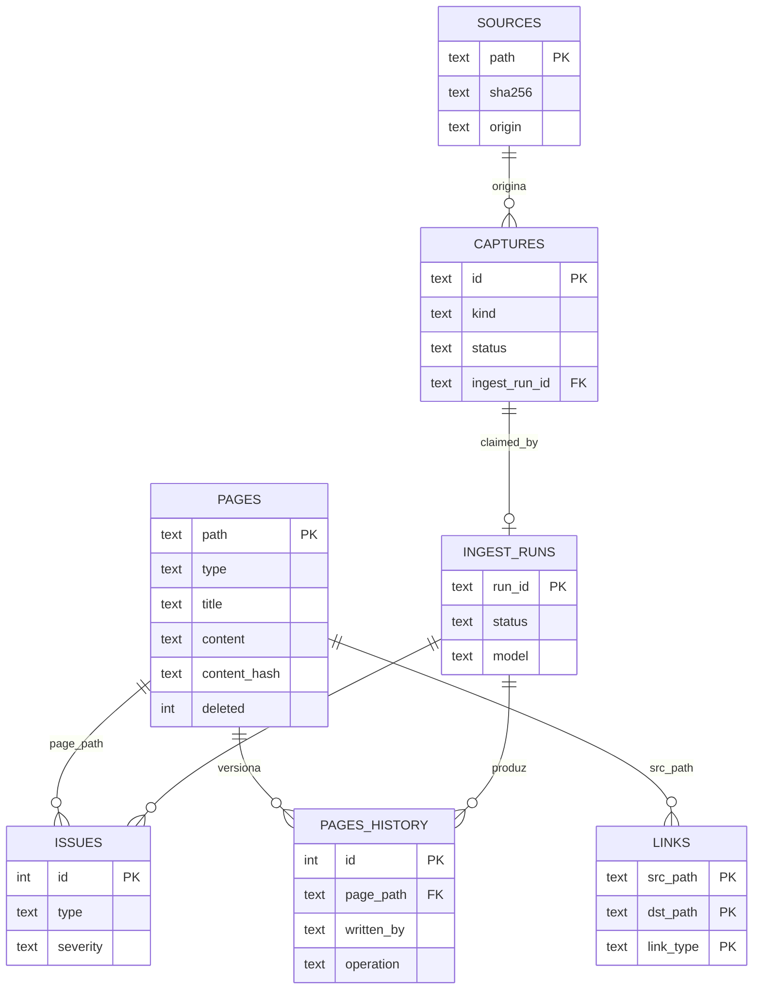

# Kura — Spec de Reimplementação (agnóstica de stack)

> **Propósito.** Engenharia reversa do repositório `kura` (v0.4.0) para reimplementação do zero em outra
> tecnologia. Descreve **comportamento e regras** (portável), separando do **"como" do stack atual**
> (Python stdlib + JS vanilla), descartável. Onde algo não foi confirmado, está **NÃO ENCONTRADO NO CÓDIGO**.
> Secrets aparecem só por **nome/papel**, nunca valor.

---

## Reconhecimento do código (stack atual — descartável)

- **Runtime**: Python 3.10+, **somente stdlib** obrigatória (zero `pip install`). Sem `package.json`/
  `pyproject.toml`/`requirements.txt`/`go.mod`. Versão em `VERSION` (`0.4.0`).
- **Libs opcionais com graceful-degrade** (fallback stdlib; ver `kura/installer/doctor.py`): `rich`, `PyYAML`,
  `websockets`, `msal`, `httpx`, `click`, `Pillow`, `PyMuPDF`/`fitz`, `pytesseract`. SO opcional: `pdftotext`
  (Poppler), Tesseract OCR.
- **Frontend**: SPA JavaScript vanilla, sem build. 7 bundles `templates/spa/01..07_*.js` inlinados num único
  `<script>` em `templates/app.html` em tempo de request (`AppContext.load_template`). CSS em
  `templates/design.css` (design system `.k-*`).
- **Entrypoints**: `python3 -m kura <cmd>` → `kura/__main__.py:10-16` escolhe `cli_click` (se `click`) ou
  `cli` (argparse). Servidor: `kura app` → `kura/app_server.py::run_app` (`127.0.0.1:8765`,
  `ThreadingHTTPServer`). Collector: `kura daemon`/`cycle-once`. Vault: `kura vault <sub>`. Background: launchd.
- **Estrutura**: pacote `kura/` com módulos-raiz (`app_server.py` ~6k linhas/rotas HTTP, `cli.py`/
  `cli_click.py`, `config.py`, `chat_store.py`, `pre_project_store.py`, `dashboard_data.py`, `devin_chat.py`,
  `summarize.py`, `text_extract.py`, `attachments.py`, `i18n.py`, `branding.py`, `certs.py`, `paths.py`,
  `daemon.py`, `title_refresher.py`, `models.py`, `migrate.py`) + subpacotes `teams/` (collector Graph + web/
  CDP, `scrape.js`, auth, storage), `vault/` (DB SQLite+FTS5, ingest, ask, discuss, lint, consolidate, export,
  watcher, prompts, seeds), `projects/` (mini-vault), `queue/` (inbox→processed/failed), `llm/` (router,
  client `devin -p`, audit), `installer/` (doctor, package, setup, upgrade, migrate). Dados em `data/` e nos
  workspaces Johnny-Decimal `~/Documents/{10-Pre-Projects,20-Projects,30-Queue,80-Vault}`.

---

## 1. Visão geral

Kura (蔵, "armazém") é um **"segundo cérebro" local-first** que roda inteiro na máquina (macOS). Resolve
**capturar, resumir e consultar conhecimento pessoal e de trabalho** — em especial conversas do Microsoft
Teams — sem nuvem de terceiros e sem credenciais corporativas customizadas. Três subsistemas frouxamente
acoplados (`README.md:36-50`): **(1) Collector/Summarizer** (Teams→Markdown + resumo diário via LLM);
**(2) App SPA** (chat estilo ChatGPT, pre-projects, projects, queue, servido por HTTP local); **(3) Vault**,
wiki pessoal **mantida incrementalmente por LLM** (inspiração: gist de Karpathy), com SQLite+FTS5 como fonte
da verdade. Acesso a LLM via **Devin CLI local** (`devin -p`), sem chave de API. Público-alvo: usuário técnico
em ambiente corporativo restrito (SSL inspection, Conditional Access, PyPI bloqueado).

---

## 2. Inventário de funcionalidades

> Formato: **nome** — descrição · *gatilho* · resultado.

### Collector / Summarizer
- **Coleta Teams (graph)** — chats/canais via Graph delta. *`kura daemon`/`cycle-once`, backend graph*. →
  `data/conversations/<Grupo> - YYYYMMDD.md` (`kura/teams/collector.py`).
- **Coleta Teams (web)** — scraping de teams.microsoft.com via Edge+CDP (quando Conditional Access bloqueia).
  *backend web*. → mesmos `.md` (`kura/teams/web_collector.py`, `scrape.js`).
- **Login device-code** — auth Microsoft. *`kura auth login`*. → token local (`kura/teams/auth.py`).
- **Verify/doctor** — checa SSL, token, `/me`, `devin`, libs. *`kura verify`/`doctor`*. → relatório
  (`installer/doctor.py`).
- **Resumo diário + cross-ref** — resumo por grupo + executivo. *`--resume`*. → `data/summaries/<date>/...` +
  dashboard HTML (`kura/summarize.py`).

### App SPA
- **Chat persistente** — chat com histórico/streaming/anexos/modelo. *`POST /api/chats/.../messages/stream`*.
  → `data/chats/<uuid>.json` (`chat_store.py`, `devin_chat.py`).
- **Chat anônimo** — stateless, só na aba. *`POST /api/anon/messages/stream`*. → nada persistido.
- **Título auto + refresher** — título LLM a cada N msgs, salvo se travado. *background / refresh-title*.
- **Upload anexos** — extrai texto e inlina. *`POST /api/chats/{id}/upload`* (`text_extract.py`).
- **Salvar no vault** — vira captura. *`POST /api/chats/{id}/save-to-vault`*.
- **Pre-projects** — agrupa chats+arquivos+instruções+`consult_vault`. *`/api/pre-projects/*`*. →
  `10-Pre-Projects/<id>/`.
- **Projects (mini-vault)** — status/lifecycle, docs, páginas, promoção. *`/api/projects/*`*. →
  `20-Projects/<id>/`.
- **Queue** — fila de arquivos parseados+ingeridos, dedup sha256. *`POST /api/queue/process`* (`queue/pipeline.py`).
- **Dashboard** — navegação por dia dos resumos. *`/api/dashboard/*`*.
- **Setup wizard** — vault/backend/idioma/agente. *`/api/setup/*`* → `.env`.
- **Upgrade in-app** — `.tar.gz`, valida/backup/swap/restart/rollback. *`/api/upgrade/*`*.
- **Settings** — tema/menus/idioma/focus/eggs (ver §8).
- **Busca global** — vault + arquivos pre-projects + docs projects. *`GET /api/search`* (`⌘K`).

### Vault
- **Init/reset** — cria estrutura + DB. *`kura vault init`* (`vault/db.py`, `init.py`).
- **Ingest one-shot** — lê fonte→LLM→páginas+snapshot. *`POST /api/vault/ingest`* (`vault/ingest.py`).
- **Ingest discuss (2 fases)** — propõe (sem escrever) → aplica com notas. *`/api/vault/discuss[+/apply]`*.
- **Ask/RAG** — FTS5 + leitura inline + citações; salva como `wiki/queries/<slug>.md`. *`/api/vault/ask`*.
- **Web gap-fill** — busca web no ask frio. *`--web` + flag* (`vault/web_gap_fill.py`).
- **Lint / Consolidate / Reindex / Export / Health / Stats / Graph / Backlinks / Issues** — manutenção.
- **Inbox** — candidatos a ingest, skip/dismiss. *`/api/vault/inbox*`*.
- **Auto-ingest watcher** — vigia inbox/raw. *`KURA_VAULT_WATCH=true` / `kura vault watch`*.
- **Bootstrap-teams** — consolida `data/summaries/` no vault. *`kura vault bootstrap-teams`*.

---

## 3. Fluxos de usuário

### 3.1 Setup (primeira execução)
1. `python3 -m kura app` → servidor sobe, abre browser. 2. SPA detecta não-inicializado → `#/setup`. 3. User
escolhe vault, backend Teams, idioma, `KURA_INITIAL_SINCE_DAYS`, agente launchd. 4. `POST /api/setup/apply`
grava `.env` + inicializa vault. **Sucesso**→`#/new`; **erro de escrita**→callout, fica no wizard;
**skip**→`/api/setup/skip`.

### 3.2 Chat persistente
1. `#/new` → cria chat (`POST /api/chats`) + stream. 2. Servidor monta prompt (histórico + SYSTEM_PROMPT +
instruções do scope + opcional vault context), chama `devin -p`, faz streaming; loader daruma na 1ª delta.
3. Refresher gera título se `title_locked=False`. **Erro LLM**→`LLMError`, UI sem stack. **Concorrência**:
múltiplos chats streamam juntos (`state.sendingChats:Set`). **Rename manual**→trava título.

### 3.3 Chat anônimo
`#/anon` → cada envio manda histórico inteiro; servidor não persiste; refresh destrói.

### 3.4 Pre-project / Project
1. Criar → nome vira slug `[a-z0-9][a-z0-9-]*`. **Colisão**→`409`. 2. Anexa arquivos (textificados→`.md`),
define `instructions`/`consult_vault`. 3. Chats do scope ocultos da sidebar principal. 4. **Deletar
pre-project**→chats voltam a free-standing (não apaga); projects→soft-delete `.trash/` restaurável.
5. Promover: pre-project→project; página/projeto→vault.

### 3.5 Queue
1. Solta arquivos em `30-Queue/inbox/`; `POST /api/queue/process`. 2. Por arquivo: sha256→dedup→parser→
ingest→`processed/`. **Duplicata**→`--duplicate`+`duplicate_of`; **sem parser/mídia**→`failed/`+`.error.txt`;
**erro**→idem. **Concorrência**: `flock(LOCK_EX|LOCK_NB)`, 2ª simultânea→`RuntimeError`.

### 3.6 Vault ask
1. `POST /api/vault/ask`: signal terms→FTS5→≤7 candidatos→leitura inline. 2. LLM responde com citações;
claims externos marcados `(from training data; not in vault)`. **Frio + --web + flag**→web gap-fill+re-busca.
**--save**→`wiki/queries/<slug>.md`.

### 3.7 Upgrade
`#/settings/upgrade` → arrasta `.tar.gz` → valida MANIFEST→backup `data/_backups/`→swap→restart;
**falha**→rollback automático.

---

## 4. Regras de negócio (com citação)

- **Escopo de chat mutuamente exclusivo** — free-standing OU 1 pre-project OU 1 project. Localização em disco
  é a fonte da verdade; `pre_project_id`/`project_id` denormalizados e re-derivados no save; `project_id`
  vence. (`chat_store.py:91-101,297-387`).
- **Detach seguro** — deletar scope move chats de volta a free-standing, não apaga. (`chat_store.py:596-623`).
- **Título auto vs travado** — `title_locked=True` após rename impede refresher; `unlock_title` zera
  `title_msg_count`. `auto_title`: 6 palavras/60 chars, remove markdown. (`chat_store.py:180-194,464-490`).
- **Unicidade global de título** — colisão→sufixo `(2)`,`(3)`… em todos os scopes. (`chat_store.py:492-524`).
- **Slug/id project/pre-project** — `^[a-z0-9][a-z0-9-]*$`; UUID hex antigos válidos (subset); nome não-vazio.
  (`projects/schema.py:79,120-149`).
- **Status project** — `active|paused|archived|deleted` (deleted=soft-delete `.trash/`).
  (`projects/schema.py:67-72`).
- **Backend Teams** — só `graph|web`; outro→`ValueError`. (`config.py:292-296`).
- **Janela inicial (W14)** — `KURA_INITIAL_SINCE_DAYS` vazio/`all`/`0`→sem filtro; 1..3650→pula chats com
  `last_activity_at` antigo; não-numérico→ignora+warning. Filtro por CHAT; ortogonal a `backfill_hours`
  (filtra MENSAGENS). Canais não filtrados. (`config.py:322-340`, `collector.py:69-94`).
- **Backfill** — sem delta-link→últimas `backfill_hours` (24); com→delta. (`collector.py:133-145`).
- **Replies de canal** — delta não traz replies; busca-as quando post tem replies. (`collector.py:171-207`).
- **Scopes Graph** — `Chat.Read, ChannelMessage.Read.All, Channel.ReadBasic.All, Team.ReadBasic.All,
  User.Read, offline_access` (offline_access forçado); client ID = app público MS Graph CLI Tools.
  (`config.py:75-82,282-288`).
- **Roteamento de modelo** — `chat/title/tag`→`swe`; `ask_rag/summarize_group/crossref/digest_daily`→`sonnet`;
  `ingest/consolidate/lint/rewrite`→`opus`. Prioridade: override > `KURA_MODEL_<TASK>` > default >
  `KURA_MODEL_DEFAULT` > `None`. (`llm/router.py:38-73`).
- **sha256 short-circuit no ingest** — fonte já ingerida com mesmo hash→skip. (`vault/ingest.py:112-117`).
- **Ask cap** — `MAX_CANDIDATES=7`; sem subagent, trunca em 7 e lê inline. (`vault/ask.py:53-56`).
- **Dedup queue** — sha256; duplicatas no mesmo batch deduplicam; queue não-recursiva. (`queue/pipeline.py:96-123`).
- **Skip cross-ref** — `skip_crossref` ou ≤1 grupo→sem overview. (`summarize.py:176-184`).
- **Cap de bytes inlinados** — anexos de pre-project ≤200_000 bytes/prompt. (`devin_chat.py:43`).
- **Substituição de porta** — só mata processo Kura; não-Kura sem evidência→recusa, salvo
  `KURA_REPLACE_RUNNING=force`. (`app_server.py:5811-5890`).
- **Sanitização path vault** — rejeita `..`/abs; alguns exigem prefixo `wiki/` e `.md`.
  (`app_server.py:1817,5463-5469`).
- **Legacy `TC_*`** — não lidos desde v0.3.0; só warning. (`config.py:97-125`).

---

## 5. Modelo de dados

### 5.1 Entidades de arquivo
- **Chat** (`data/chats/<uuid>.json` ou em scope) — `id`(32 hex), `title`, `created_at`, `updated_at`,
  `model`, `title_msg_count:int`, `title_locked:bool`, `pre_project_id?`, `project_id?`,
  `messages:[{role,content,ts,attachments:[{name,size,mime,path,extracted}]}]`. (`chat_store.py:56-153`).
- **PreProject** (`10-Pre-Projects/<id>/pre_project.json`) — `id`, `name`, `description`, `instructions`,
  `consult_vault:bool`, `favorite:bool`, `files:[{name,size,mime,path,markdown_path,extracted,ingested_at}]`,
  timestamps. (`pre_project_store.py:82-110`).
- **Project** (`20-Projects/<id>/project.yaml`) — `id`(slug), `name`, `status`, `description`, `instructions`,
  `consult_vault:bool`, `favorite:bool`, `created_at`, `updated_at`, `tags:[str]`. (`projects/schema.py:91-118`).
- **Conversations** `data/conversations/<Grupo> - YYYYMMDD.md`; **Summaries** `data/summaries/<date>/...`.

### 5.2 SQLite do Vault (`<vault>/.kura/wiki.db`, `SCHEMA_VERSION=2`, FTS5) — `vault/db.py:69-234`
- **pages** (PK `path`): `type,title,slug,content,body,frontmatter,content_hash,created_at,updated_at,
  manual_edits,deleted`.
- **pages_history**: `id,page_path,content,content_hash,written_at,written_by,operation`.
- **pages_fts** (FTS5 `path UNINDEXED,title,body`, `unicode61 remove_diacritics 2`), triggers de sync.
- **links**: `src_path,dst_path,label,link_type(wiki|tag|mention)` (PK composta; dst pode ser dangling).
- **sources** (PK `path`): `sha256,origin,first_ingested,last_ingested,pages_touched,ok`.
- **captures** (PK `id`): `title,kind,evidence,body,body_size,suggested_action,created_at,status,
  rejected_reason,ingest_run_id`.
- **ingest_runs** (PK `run_id`): `capture_id,started_at,ended_at,status,exit_code,model,pages_touched,latency_ms`.
- **issues** (PK `id`): `ts,ingester_run_id,capture_id,page_path,type,severity,detail,suggested_action,
  resolved,resolved_at,resolved_by`.
- **llm_audit** (PK `id`): `ts,task,model,target,ok,error,latency_ms,bytes_in,bytes_out` (espelho do JSONL).
- **sources_skipped** (PK `path`): `skipped_at,reason`. **schema_meta** (k/v): `version,source_of_truth,created_at`.

PRAGMAs em toda abertura: `WAL`, `foreign_keys=ON`, `synchronous=NORMAL` (`db.py:311-321`). Relações de FK
são parciais — tratar como **lógicas** (várias por convenção de string).

### 5.3 Diagrama ER



---

## 6. Contratos / APIs (HTTP local, `127.0.0.1:8765`)

Servidor stdlib `ThreadingHTTPServer`; despacho por tabela regex (`app_server.py::ROUTES`, 5670-5803).
Respostas JSON; erros via `_HTTPError(status,msg)` sem vazar stack (`app_server.py:599-614`). Sem auth além do
bind localhost (ver §12). Lista completa (método · rota · propósito):

### Núcleo / chat
- `GET /` — serve a SPA. `GET /api/health` — healthcheck. `GET /api/models` — modelos (`models.py`).
- `POST /api/rewrite-instructions` — reescrita IA de instruções.
- `GET|POST /api/chats` — listar/criar. `GET|PATCH|DELETE /api/chats/{id}` — obter/renomear/excluir (32 hex).
- `POST /api/chats/{id}/messages/stream` · `.../messages` — enviar (streaming/não).
- `POST /api/anon/messages/stream` — chat anônimo stateless.
- `POST /api/chats/{id}/refresh-title` · `.../unlock-title` — título.
- `POST /api/chats/{id}/upload` — anexo. `POST /api/chats/{id}/save-to-vault` — captura.
- `PATCH /api/chats/{id}/pre-project` — mover chat.
- `GET /api/files/{chat}/{name}` · `.../{name}/thumb` — anexo / thumbnail.
- `GET /api/teams/sidebar-chats` — chats coletados do Teams.

### Dashboard
- `GET /api/dashboard/days` · `GET /api/dashboard/{YYYY-MM-DD}`.

### Vault
- `GET /api/vault/tree` · `GET|PUT /api/vault/page` · `GET /api/vault/search` · `GET /api/search` (global).
- `GET /api/vault/{backlinks,stats,health,export,export-templates,graph,graph-config,issues}` ·
  `PUT /api/vault/{settings,graph-config}`.
- `POST /api/vault/{init,reset,reindex,ask,lint,discuss,ingest}` · `POST /api/vault/discuss/{run_id}/apply`
  (`di-[0-9]+-[0-9a-f]+`).
- `GET /api/vault/{inbox,inbox/skipped,watch/status,consolidate/proposals}` ·
  `POST|DELETE /api/vault/inbox/skip` · `POST /api/vault/consolidate/{run,apply}`.

### Pre-projects
- `GET|POST /api/pre-projects` · `GET|PATCH|DELETE /api/pre-projects/{id}`.
- `POST /api/pre-projects/{id}/{files,collect-teams-chat,chats,promote-to-project}`.
- `GET|DELETE /api/pre-projects/{id}/files/{name}` · `.../files/{name}/{markdown,ingest-vault}`.

### Queue
- `GET /api/queue/state` · `POST /api/queue/process` · `POST /api/queue/process/{id}`.

### Projects (mini-vault)
- `GET|POST /api/projects` · `GET|PATCH|DELETE /api/projects/{id}` · `PATCH .../status` · `POST .../restore`.
- `POST .../{promote-page,promote,chats,files,collect-teams-chat}` ·
  `GET|DELETE .../files/{name}` · `.../files/{name}/{markdown,ingest}`.
- `GET .../pages` · `GET|PUT .../page`.

### Setup / Settings / Upgrade
- `GET /api/setup/state` · `POST /api/setup/{apply,skip,run-collect,create-folder}` · `GET /api/setup/list-folder`.
- `POST /api/settings/language` — único writer runtime de `.env` (`KURA_LANG` via `set_managed_env_key`).
- `GET /api/upgrade/status` · `POST /api/upgrade/{upload,apply,rollback}`.
- `GET /api/supported-extensions` — extensões de upload (`text_extract.py`).

**Erros comuns**: `400` (param ausente/inválido), `404` (não encontrado), `409` (slug duplicado),
`500` (interno, mensagem genérica).

### CLI (contrato público adicional)
`python3 -m kura` expõe ~32 subcomandos (paridade argparse/click): `app`, `daemon`, `cycle-once`,
`auth login`, `verify`, `doctor`, `--resume`, `installer {package,setup,migrate,upgrade}`,
`vault {init,reset,ingest,ask,lint,consolidate,reindex,export,health,stats,watch,bootstrap-teams,discuss}`.
(`cli.py`, `cli_click.py`).

---

## 7. Integrações externas

- **Microsoft Graph API** (backend `graph`) — coleta delta de chats/canais/mensagens. Auth via **Device Code
  Flow** com app público "Microsoft Graph Command Line Tools" (sem registro Azure AD). Token cacheado local.
  Falha→`GraphError` logado, cycle segue. (`teams/auth.py`, `graph_client.py`, `collector.py:55-67`).
- **Microsoft Teams Web** (backend `web`) — scraping de teams.microsoft.com em **Edge** dedicado via **CDP**
  sobre WebSocket; injeta `scrape.js`; pagina a lista virtualizada (knobs `KURA_WEB_SCROLL_*`). Auth = sessão
  do perfil Edge. Falha→warning, segue. (`teams/web_collector.py`, `cdp.py`, `ws_client.py`, `edge_session.py`).
- **Devin CLI (LLM)** — TODO LLM via subprocess `devin -p --prompt-file <tmp> [--model X]`
  (`llm/client.py:56-139`). Env `DEVIN_*` do pai é limpo. Falha (exit≠0/timeout)→`LLMError`. Sem chave de API.
- **Poppler `pdftotext`** — texto de PDF (opcional). **Tesseract OCR** — OCR de imagem (opcional); sem texto +
  `KURA_IMAGE_DESCRIBE_ENABLED=true`→describe via LLM. (`text_extract.py`, `attachments.py`).
- **macOS Keychain** — extrai CA bundle p/ contornar SSL inspection (`certs.py`).
- **WebFetch (via Devin)** — gap-fill do ask, sujeito a allowlist (`web_gap_fill.py`).
- **launchd (macOS)** — agente de background do daemon (`daemon.py`, `installer/setup.py`).

---

## 8. Configuração & ambiente

Todas as chaves usam prefixo `KURA_*`, lidas de env + `.env` na raiz (`config.py::load_config`). Defaults entre
parênteses. **Nenhum secret em env** — tokens Microsoft no cache local do device-code.

### Globais / paths
- `KURA_HOME` (dir que contém `kura/`), `KURA_TIMEZONE` (`America/Sao_Paulo`), `KURA_LOG_LEVEL` (`INFO`).
- `KURA_DATA_DIR` (`data`), `KURA_PROMPTS_DIR` (`prompts`), `KURA_LOGS_DIR` (`logs`),
  `KURA_VAULT_DIR` (`~/Documents/80-Vault`), `KURA_PRE_PROJECTS_DIR` (`~/Documents/10-Pre-Projects`).
- `KURA_LANG` — idioma (único escrito em runtime via `/api/settings/language`).

### Teams collector
- `KURA_TEAMS_BACKEND` (`graph`|`web`), `KURA_TEAMS_POLL_SECONDS` (`30`), `KURA_TEAMS_BACKFILL_HOURS` (`24`),
  `KURA_INITIAL_SINCE_DAYS` (vazio=sem filtro).

### Microsoft Graph
- `KURA_GRAPH_CLIENT_ID` (app público), `KURA_GRAPH_TENANT` (`organizations`), `KURA_GRAPH_SCOPES` (CSV;
  `offline_access` forçado).

### Web scraping (Edge/CDP)
- `KURA_EDGE_BIN`, `KURA_EDGE_PORT` (`9222`), `KURA_EDGE_PROFILE_DIR` (`data/state/edge-profile`),
  `KURA_WEB_SCROLL_MAX_STEPS` (`50`), `KURA_WEB_SCROLL_STEP_WAIT_MS` (`800`), `KURA_WEB_SCROLL_MAX_WAIT_MS` (`30000`).

### LLM
- `KURA_DEVIN_BIN` (`devin`), `KURA_MODEL_DEFAULT` (vazio),
  `KURA_MODEL_{CHAT,TITLE,TAG,ASK_RAG,SUMMARIZE_GROUP,CROSSREF,DIGEST_DAILY,INGEST,CONSOLIDATE,LINT,REWRITE}`,
  `KURA_REWRITE_TIMEOUT` (`60`).

### Vault watcher / gap-fill / export / imagem
- `KURA_VAULT_WATCH` (`false`), `KURA_VAULT_WATCH_DIRS` (`inbox,raw/personal`), `KURA_VAULT_WATCH_INTERVAL`
  (`30`), `KURA_VAULT_WATCH_MIN_AGE` (`5`).
- `KURA_WEB_FETCH_ENABLED` (`false`), `KURA_WEB_FETCH_DOMAINS_ALLOWLIST` (vazio=todos).
- `KURA_EXPORT_DEFAULT_TEMPLATE` (`default`; `default`/`corporate`), `KURA_EXPORT_TEMPLATES_DIR`,
  `KURA_IMAGE_DESCRIBE_ENABLED` (`false`).

### Operacional
- `KURA_REPLACE_RUNNING` (`force`). **Legacy não-lidos**: `TC_*` (só warning).

### Client-side (não em `.env`)
- `localStorage.{kuraTheme,kuraMenusEnabled,kuraLang,kuraFocusMode}` + toggles por egg (`data-eggs-disabled`).
  Matriz de persistência detalhada em `AGENTS.md`.

---

## 9. Jobs / tarefas em background

- **Daemon collector** (`kura daemon`, `daemon.py`) — loop `Collector.run_cycle()` a cada
  `KURA_TEAMS_POLL_SECONDS` (30s); `cycle-once` = um ciclo.
- **Vault auto-ingest watcher** (`vault/watcher.py`+`watch.py`) — se `KURA_VAULT_WATCH=true`, thread no daemon
  (ou `kura vault watch`): a cada `INTERVAL` (30s) varre `WATCH_DIRS` e ingere novos/modificados, deferindo os
  modificados há < `MIN_AGE` (5s, anti-race).
- **Title refresher** (`title_refresher.py`) — regenera título a cada N novas mensagens se não travado
  (acionado no fluxo de chat, não cron fixo).
- **launchd agent** — mantém o daemon vivo (macOS).
- **Threads do server** — `ThreadingHTTPServer` atende requests concorrentes; cada `devin -p` é subprocess.
- **Cron de resumo por horário** — **NÃO ENCONTRADO NO CÓDIGO** scheduler interno fixo; resumo via
  `--resume`/pipeline/`run-collect`; agendamento fica a cargo do launchd externo.

---

## 10. Algoritmos / lógica central (pseudocódigo agnóstico)

### 10.1 Ciclo de coleta (graph)
```
function run_cycle(cfg, graph, state, store):
    chats = graph.list_chats(); channels = graph.all_channels()   # tolera falha → []
    if cfg.initial_since_days != null:
        cutoff = now_utc - days(cfg.initial_since_days)
        chats = [c for c in chats if c.last_activity_at is null or c.last_activity_at >= cutoff]
    for scope in chats + channels:
        state.remember_name(scope.id, scope.display_name)
        delta = state.get_delta_link(scope.id)
        backfill = (delta==null) ? now_utc - hours(cfg.backfill_hours) : null
        raw, new_delta = graph.messages_delta(scope, delta_link=delta, backfill_since=backfill)
        if new_delta: state.set_delta_link(scope.id, new_delta)
        msgs = [normalize(r) for r in raw if normalize(r)!=null]
        if scope is channel: msgs += fetch_replies_for_posts_with_replies(scope, raw)
        store.append_messages(scope.display_name, msgs)   # → "<Grupo> - YYYYMMDD.md"
    state.save()
```

### 10.2 Resumo diário
```
function summarize_day(cfg, date):
    for f in conversation_files_for(date):
        summary = devin_p(render(per_group_template,{group,date,transcript=read(f)}), task="summarize_group")
        write(by-group/<group>.md, summary)
    if not skip_crossref and count(groups)>1:
        crossref = devin_p(render(crossref_template,{all_summaries}), task="crossref")
        write(overview.md, header + crossref + links)
    generate_html_dashboard(date)
```

### 10.3 Chat (uma resposta)
```
function chat_reply(chat, user_msg):
    prompt = SYSTEM_PROMPT + scope_instructions(chat)
           + (consult_vault ? vault_context_top5(user_msg) : "")
           + render_history(chat.messages + user_msg)   # <file>...</file> dos anexos (≤200KB)
    stream = devin_p_stream(prompt, model=router.model_for("chat", chat.model))
    emit deltas → client (daruma até a 1ª)
    append assistant_msg; save(chat)
    if not chat.title_locked and msgs_since_title>=N:
        chat.title = devin_p(title_prompt, task="title"); save(chat)
```

### 10.4 Vault ingest (one-shot)
```
function ingest_source(cfg, vault, source):
    content=read(source); h=sha256(content)
    if sources[source].sha256==h: return SKIP("sha256-match")
    ctx={AGENTS.md, index.md, tail(log.md), fts_top_k_candidates(content)}
    run=open_ingest_run(status="started", model)
    raw=devin_p(render(ingest_template, ctx+{source}), task="ingest")     # default opus
    env=parse_envelope(raw)                                               # {summary, pages[], issues[], log_entry}
    TRANSACTION:
        upsert sources(h, origin)
        for op in env.pages: write pages + pages_history(written_by="llm:<model>") + rebuild links
        insert env.issues; mark run completed
    export_paths(env.touched) → wiki/*.md; regenerate index.md; append log.md
```

### 10.5 Discuss-before-write (2 fases)
```
Phase1 discuss_source(source):
    proposal=devin_p(render(ingest-discuss, ctx))   # {summary,takeaways,proposed_pages,anomalies,questions}
    save(.kura/discuss/<run_id>.json, proposal)      # NADA no DB
Phase2 apply_discussion(run_id, user_notes):
    env=devin_p(render(ingest-write, load(run_id)+user_notes)); apply_envelope(env)  # mesma TX de 10.4
```

### 10.6 Ask / RAG
```
function ask(vault, question, limit=7, web=false):
    signals=extract_signal_terms(question, top_n=12)
    hits=fts5_search(safe_fts_query(signals), limit)
    if web and hits.empty and web_enabled:
        gap=webfetch_and_ingest(question)            # salva raw/clipped/, re-ingere
        if gap.ok: hits=fts5_search(...)
    answer=devin_p(render(ask_template,{agents_md,question,candidates=full_content(hits),count}), task="ask_rag")
    if save: file_as("wiki/queries/<slug>.md", answer)   # via apply_envelope
    return {answer, candidates, cold=hits.empty}
```

### 10.7 Queue pipeline (por arquivo)
```
lock flock(LOCK_EX|LOCK_NB); seen=seen_hashes()
for f in sorted(inbox):                # não-recursivo
    h=sha256(f)
    if h in seen: move(processed,"--duplicate"); log(duplicate_of=first_with(h)); continue
    parser=parser_for(ext(f)) or fail("no parser"/"unsupported media")
    parsed=parser.parse(f)             # exceção → failed/ + .error.txt
    page_id=ingest_fn(parsed)          # stage raw/queue/<title>__<ts>.md → vault.ingest_source
    move(processed); log(ingested,page_id); seen.add(h)
```

### 10.8 Roteamento de modelo
```
function model_for(task, override):
    if override: return override
    if env[KURA_MODEL_<TASK>]: return it
    if task in TASK_DEFAULTS: return TASK_DEFAULTS[task]   # chat→swe, ask_rag→sonnet, ingest→opus
    return env[KURA_MODEL_DEFAULT] or null                # null = sem --model
```

---

## 11. Experiência (UX / CX / Visual)

### 11.1 Identidade / design tokens (`templates/design.css`)
- **Estética**: clone ChatGPT (preto/cinza + verde accent) com toques editoriais; **uma única fonte** em tudo
  (`--font`), fallback CJK p/ o kanji 蔵 (`design.css:72-84`).
- **Cores dark** (`design.css:44-53`): `--bg:#212121 --sidebar:#171717 --surface:#2F2F2F
  --surface-hover:#3F3F3F --border:#2F2F2F --text:#ECECEC --text-2:#B4B4B4 --text-3:#8E8E8E --link:#7AB7FF
  --accent:#10A37F --red:#EF4444 --orange:#F59E0B --green:#10B981 --user-bubble:#2F2F2F`.
- **Cores light** (`:54-63`): `--bg:#FFFFFF --sidebar:#F9F9F9 --surface:#F4F4F4 --text:#0D0D0D --link:#2F80ED
  --accent:#10A37F --red:#DC2626 --orange:#D97706 --green:#059669`.
- **Tipografia** (escala 6, `:101-108`): `--fs-2xs:10 --fs-xs:11 --fs-sm:12 --fs-base:13.5 --fs-md:14
  --fs-lg:16 --fs-xl:24 (page title) --fs-display:30 (hero)`. LH `tight:1.3 normal:1.5 relaxed:1.6`.
- **Espaçamento** (grid 4px): `--space-1:4 … --space-7:48`. **Raio**: `--radius-sm:6 … --radius-xl:14`.
- **Sistema `.k-*`** (13 seções): tipografia (`.k-title/.k-heading/.k-eyebrow`), layout (`.k-page` 820px/48px
  top, `.k-card`, `.k-toolbar`), form (`.k-input/.k-textarea/.k-field`), ações (`.k-btn` + `primary/ghost/
  danger` + `sm/lg`), feedback (`.k-pill/.k-callout/.k-empty`), nav (`.k-tab-strip/.k-tab`), surface
  (`.k-modal/.k-list/.k-status-badge`), F1 (`.k-toast/[data-tooltip]/.k-kbd`). Teste
  `tests/test_design_system_completeness.py` falha com classe órfã, título fora de `.k-title`, tamanho fora da
  escala, ou container sem `max-width:820px`.

### 11.2 Componentes / microinterações
- **Loader "thinking" (daruma)** — typewriter de ~50 verbos japoneses, 85ms/char, pausa 700ms, apaga 55ms/char,
  cursor `|` piscando (`step-end` 0.6s). `kThinkingDaruma()` (`spa/02_primitives.js`); `.kura-eater`
  (`app.html:215-218`). Substituiu o loader de pontos.
- **Spinner variantes** — `default/enso/water/sakura` sorteado se eggs ativos (`04_state.js:393-412`).
- **Mizu drop** — ripple ao clicar `.k-btn-primary` (removido após 800ms) (`04_state.js:579-597`).
- **Toast/Modais** — `kToast`, `kModal/kConfirm/kAlert/kPrompt` (`02_primitives.js`).

### 11.3 Estados de UI
- **Vazio** `.k-empty`/`kEmpty()` (hero `--fs-display`). **Loading** daruma (chat)/`kSpinner` (vault).
  **Erro** `.k-callout-error` (mensagem genérica). **Sucesso** `.k-callout-success`/toast.

### 11.4 Copy / tom / i18n
- Bilíngue **EN + pt-BR**, paridade obrigatória (175+ chaves; `tests/test_i18n.py` força simetria). Server
  `i18n.py::t`; client `STRINGS_JS`+`t()` (`spa/01_i18n.js`); resolução `window.KURA_LANG`→`localStorage.kuraLang`
  →`navigator.language`→`en`. Tom direto/conciso. SYSTEM_PROMPT instrui assistente a espelhar idioma e não
  inventar fatos (`devin_chat.py:30-37`).

### 11.5 A11y / temas / responsividade
- Temas dark/light/system (`localStorage.kuraTheme`, sync cross-aba via `storage`). Eggs `aria-hidden`;
  spinners `aria-label`. **Focus mode** (`html[data-focus-mode=on]`) esconde TODA decoração (`design.css:808-817`).

### 11.6 EASTER EGGS (busca ativa — confirmados)
Master kill-switch **Focus mode** (`kuraEggsEnabled()`) + toggle por id (`kuraEggEnabled(id)`); ids em
`spa/04_state.js:281-289`: `season-banner, kanji-cycle, daruma-blink, sakura-petals, koi-konami, koi-7x-click,
mizu-drop, cha-break` (+ `moon`). Configuráveis em **Settings → Easter eggs** (`spa/01_i18n.js:390-399`).
- **E2 Kanji cycle** — clicar a marca `.kura-mark` cicla 蔵→庫→倉→記→心→知→書 (sem persistir) (`04_state.js:351-362`).
- **E2 Daruma blink** — marca pisca em intervalo aleatório **35–90s** (anim 700ms) (`04_state.js:364-376`).
- **E3 Season banner** — faixa de 4px no topo conforme estação (spring/summer/autumn/winter) (`04_state.js:414-435`).
- **E3 Spinner variants** — `enso/water/sakura` aleatórios (`04_state.js:393-412`).
- **E4 Konami** — `↑↑↓↓←→←→ b a` (ignorado em inputs) faz um **koi** (SVG laranja) nadar pela tela ~5s
  (`04_state.js:446-470,486-511`).
- **E4 Koi 7x-click** — clicar o label "kura" **7× em <5s** também invoca o koi (`04_state.js:472-484`).
- **E5 Sakura petals** — burst de pétalas por **15s** no boot (cadência dobra na primavera) (`04_state.js:524,549-573`).
- **E6 Mizu drop** — ripple em botão primário (`04_state.js:579-597`).
- **E6 Cha break** — após **~45min** de atividade contínua, toast lembrando pausa para chá; idle reseta o timer
  (`04_state.js:599-608`, `_CHA_BREAK_MS=45*60*1000`).
- **E7 Moon** — lua decorativa nas horas noturnas (**22:00–05:59**) (`04_state.js:614-619`).

---

## 12. Segurança / privacidade / compliance

- **Local-first**: tudo roda na máquina; o servidor faz **bind apenas em `127.0.0.1`** (não exposto na rede).
  Não há login/sessão na API — o modelo de ameaça assume um único usuário local de confiança.
- **Sem secrets em código/env**: acesso a LLM é via `devin` CLI local (config do próprio Devin); tokens
  Microsoft ficam no cache do device-code flow. **NÃO ENCONTRADO NO CÓDIGO** chaves de API hardcoded.
- **Higiene de subprocess**: env `DEVIN_*` do processo pai é removido antes do `devin -p` filho
  (`llm/client.py:40-53`); prompts vão por arquivo temp (apagado sempre, mesmo em erro).
- **Mensagens de erro não vazam internals**: handlers retornam texto genérico; paths/tracebacks só em log
  (`app_server.py:599-614`).
- **Proteção contra path traversal**: endpoints de vault/página rejeitam `..` e paths absolutos; vários exigem
  `wiki/` + `.md` (`app_server.py:1817,5463-5469`). Uploads sanitizam filename (`chat_store.py:647-650`).
- **Substituição de processo conservadora**: só mata processo que comprovadamente é Kura na porta; caso
  contrário recusa (override explícito `KURA_REPLACE_RUNNING=force`) (`app_server.py:5811-5890`).
- **Auditoria de LLM**: toda chamada gera linha em `.kura/audit/llm_audit.jsonl` + tabela `llm_audit`
  (task, model, ok, latency, bytes) (`llm/audit.py`, `llm/client.py:121-134`).
- **SSL inspection corporativa**: `certs.py` extrai o CA bundle do Keychain para evitar erros de verificação.
- **Privacidade de dados**: conteúdo do Teams e do vault nunca sai da máquina, exceto quando o usuário opta
  por web gap-fill (sujeito a allowlist de domínios). Web fetch é **off por padrão**.
- **LGPD/compliance**: por ser local-first e single-user, não há tratamento de dados de terceiros em
  servidor remoto; políticas formais **NÃO ENCONTRADAS NO CÓDIGO** (decisão de produto a definir).

---

## 13. Critérios de aceite / casos de teste

> Derivados das regras (§4) e do test-suite existente (`tests/`). Formato Gherkin-like.

### Chat / scope
- **CT-01** Dado um chat free-standing, quando movido a um pre-project, então o arquivo JSON é fisicamente
  movido para `<pp>/chats/` e `project_id` fica `null`.
- **CT-02** Dado um chat em pre-project, quando o pre-project é deletado, então o chat reaparece em
  `data/chats/` com `pre_project_id=null` (não é apagado).
- **CT-03** Dado um título renomeado manualmente, quando chegam N novas mensagens, então o refresher NÃO
  sobrescreve (até `unlock-title`).
- **CT-04** Dois chats com o mesmo título → o segundo recebe sufixo `(2)`.
- **CT-05** Chat anônimo: após refresh da aba, nenhum arquivo é criado no servidor.

### Collector
- **CT-06** `KURA_INITIAL_SINCE_DAYS=7` pula chats com `last_activity_at` > 7 dias; chats sem
  `last_activity_at` são incluídos; canais não são filtrados.
- **CT-07** Primeira coleta sem delta-link usa janela de `backfill_hours`; coletas seguintes usam delta.
- **CT-08** `KURA_TEAMS_BACKEND=foo` → `ValueError` no load do config.

### Vault
- **CT-09** Ingerir a mesma fonte 2× com conteúdo idêntico → 2ª retorna `skipped` (`sha256-match`), sem nova
  página em `pages_history`.
- **CT-10** Ask com 0 candidatos retorna `cold=true`; com `--web`+flag, dispara gap-fill e re-busca.
- **CT-11** Ask com `--save` cria `wiki/queries/<slug>.md` e linhas em `pages`+`pages_history`+`ingest_runs`.
- **CT-12** Discuss fase 1 não escreve no DB; fase 2 aplica o envelope.
- **CT-13** Abrir o DB aplica migrations forward até `SCHEMA_VERSION` (idempotente).

### Queue
- **CT-14** Dois arquivos com o mesmo sha256 no mesmo batch → 1 ingerido, 1 `duplicate` com `duplicate_of`.
- **CT-15** Extensão sem parser → `failed/` + `.error.txt`.
- **CT-16** `process_inbox` concorrente → 2ª invocação levanta `RuntimeError` (lock).

### Roteamento de modelo
- **CT-17** `model_for("chat")="swe"`, `model_for("ingest")="opus"`; `KURA_MODEL_CHAT=x` sobrepõe; override
  explícito sobrepõe tudo.

### API / segurança
- **CT-18** `GET /api/vault/page?path=../etc/passwd` → `400`.
- **CT-19** Criar project com slug existente → `409`.
- **CT-20** Erro interno em handler → resposta `500` genérica, sem stack no corpo.

### UX / i18n
- **CT-21** Toda chave EN tem equivalente pt-BR e vice-versa (`tests/test_i18n.py`).
- **CT-22** Nenhuma classe `.k-*` referenciada no JS sem definição no CSS
  (`tests/test_design_system_completeness.py`).
- **CT-23** Focus mode liga → todas as decorações (`.kura-egg`) somem.

---

## 14. Glossário / decisões

### Glossário
- **Kura (蔵)** — "armazém/storehouse"; nome do produto (ex-"teams-clipping", renomeado em v0.3.0).
- **Vault** — wiki pessoal mantida por LLM; SQLite+FTS5 é a fonte da verdade, `wiki/*.md` é snapshot exportado.
- **Capture** — item pendente de ingest (fila do vault, tabela `captures`).
- **Ingest** — pipeline que lê uma fonte, chama o LLM e aplica páginas no DB + exporta Markdown.
- **Envelope** — saída estruturada do LLM no ingest (`source_summary`, `pages[]`, `issues[]`, `log_entry`).
- **Pre-project** — workspace estilo ChatGPT (chats + arquivos + instruções + `consult_vault`); JSON em
  `10-Pre-Projects/`.
- **Project (mini-vault)** — projeto com lifecycle/status + wiki própria; YAML em `20-Projects/`.
- **Queue** — drop-zone `30-Queue/` (inbox→processed/failed) com dedup sha256.
- **Collector** — coletor do Teams (backend `graph` ou `web`).
- **Delta link** — cursor do Graph para coleta incremental.
- **Daruma** — loader "thinking" (typewriter de verbos JP) + easter egg de blink na marca.
- **Devin CLI** — transporte de LLM (`devin -p`); sem chave de API.
- **Johnny Decimal** — numeração dos workspaces (10/20/30/80).
- **Focus mode** — kill-switch que esconde toda decoração/eggs.

### Decisões arquiteturais (confirmadas)
- **Zero dependências obrigatórias** — só stdlib Python; libs externas são opcionais com fallback
  (corporativo: PyPI pode estar bloqueado). [decisão de produto]
- **SQLite como fonte da verdade do vault**, Markdown como snapshot (re-export sem reconstrução), sem
  embeddings — FTS5 + LLM lendo `index.md` fazem o trabalho (`vault/db.py:37-45`).
- **Localização em disco = fonte da verdade do scope do chat** (campos denormalizados) (`chat_store.py:11-18`).
- **`id == slug`** para projects desde 2026-05-26 ("Opção A"), substituindo UUID hex (regex é superset, antigos
  ainda carregam) (`projects/schema.py:22-26`).
- **Stateless anonymous chat** (cliente dono do histórico) substituiu o modelo antigo de RAM no servidor
  (`chat_store.py:20-27`).
- **Roteamento por tarefa (swe/sonnet/opus)** balanceando custo×qualidade (`llm/router.py:8-27`).
- **`devin -p` em vez de API** — adequação a ambiente sem chaves/credenciais customizadas. [decisão de produto]

### Lacunas / NÃO ENCONTRADO NO CÓDIGO
- Scheduler interno de horário fixo para resumo diário (depende de launchd externo).
- Políticas formais de retenção/LGPD (single-user local; a definir como produto).
- Autenticação/multiusuário na API HTTP (fora de escopo: bind localhost, single-user).
