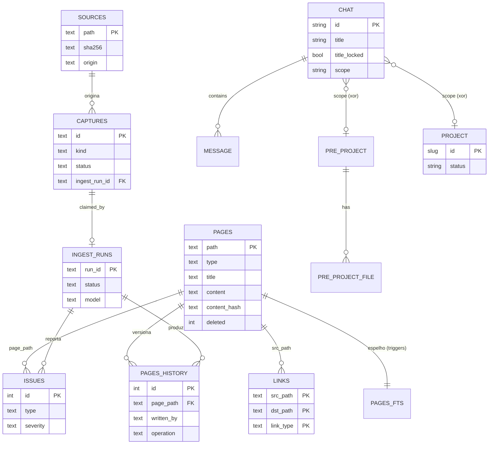

# Kura — Spec de Reimplementação (consolidada, agnóstica de stack)

> **O que é este documento.** Consolidação autossuficiente de
> `spec/01-reconhecimento.md`, `spec/02-funcional.md`, `spec/025-experiencia.md` e
> `spec/03-tecnico.md`, já com as **correções da auditoria** (`spec/04-auditoria.md`)
> aplicadas. Serve para reescrever o Kura **do zero em qualquer stack** — descreve
> comportamento, contratos e regras, separando o essencial (portável) do detalhe do
> stack atual (Python stdlib + JS vanilla), que é descartável.
>
> **Convenções.** `arquivo:linha` = citação verificada. **[INFERIDO]** = dedução.
> **NÃO ENCONTRADO** = buscado e ausente. Secrets só por nome/papel, nunca valor.
>
> **Fontes.** Os 4 documentos de camada continuam válidos como detalhe; este é o
> ponto de entrada. Onde houver contradição, esta spec vence e aponta o porquê.

---

## Sumário executivo

**Kura** (蔵, "armazém") é um **"segundo cérebro" local-first** para macOS que captura,
resume e consulta conhecimento pessoal e de trabalho — em especial conversas do
Microsoft Teams — **sem nuvem de terceiros e sem credenciais corporativas customizadas**.
Roda inteiro na máquina do usuário; o acesso a LLM é feito por um **CLI local
(`devin -p`)**, sem chave de API gerenciada pelo app.

Três subsistemas frouxamente acoplados (`README.md:36-50`):

- **Collector / Summarizer** — coleta Teams (Graph API ou scraping web Edge+CDP) →
  Markdown + resumo diário por LLM.
- **App SPA** — chat estilo ChatGPT, pré-projetos, projetos, fila, busca; servido por
  HTTP local em `127.0.0.1:8765`.
- **Vault** — wiki pessoal **mantida incrementalmente por LLM** (inspiração: gist de
  Karpathy), com **SQLite+FTS5 como fonte da verdade** e `wiki/*.md` como snapshot
  exportado.

**Escopo / modelo de ameaça.** Single-user, local, sem login/sessão na API (bind só em
localhost). Ambiente corporativo restrito (SSL inspection, Conditional Access, PyPI
bloqueado) é premissa de design — daí "zero dependências obrigatórias" (só stdlib;
libs externas são opcionais com fallback).

**Versão de referência.** `0.4.0` (`VERSION`). Schema do vault: `SCHEMA_VERSION = 2`
(`kura/vault/db.py:61`).

### Mapa do que NÃO é portável (descartável — só contexto)

- Python 3.10+ stdlib; `http.server.ThreadingHTTPServer`; SPA em JS vanilla inlinado
  num único `<script>`; persistência via SQLite/JSON/YAML/JSONL. Tudo isso é decisão
  de implementação — ver §"Decisões a tomar no novo stack".

---

## 1. Inventário de funcionalidades

> Formato: **nome** — descrição · *gatilho* · resultado · `origem`.

### Collector / Summarizer

- **Coleta Teams (graph)** — chats/canais via Graph delta. *`kura daemon`/`cycle-once`,
  backend graph*. → `data/conversations/<Grupo> - YYYYMMDD.md` (`kura/teams/collector.py`).
- **Coleta Teams (web)** — scraping de teams.microsoft.com via Edge+CDP (quando
  Conditional Access bloqueia Graph). *backend web*. → mesmos `.md`
  (`kura/teams/web_collector.py`, `scrape.js`).
- **Login device-code** — auth Microsoft. *`kura auth login`*. → token em cache local
  (`kura/teams/auth.py`).
- **Verify / doctor** — checa SSL, token, `/me`, `devin`, libs opcionais. *`kura verify`/
  `doctor`*. → relatório (`kura/installer/doctor.py`).
- **Resumo diário + cross-ref** — resumo por grupo + executivo. *`--resume`*. →
  `data/summaries/<date>/...` + dashboard HTML (`kura/summarize.py`).

### App SPA

- **Chat persistente** — histórico + "streaming" + anexos + modelo por chat.
  *`POST /api/chats/{id}/messages/stream`*. → `data/chats/<uuid>.json`
  (`chat_store.py`, `devin_chat.py`).
- **Chat anônimo** — stateless; cliente é dono do histórico; nada persiste.
  *`POST /api/anon/messages/stream`*.
- **Título automático (3 estágios)** — provisório heurístico → smart-title LLM na 1ª
  troca → refresher em background. (ver §4 e §"Algoritmos").
- **Upload de anexos** — extrai texto e inlina no prompt. *`POST /api/chats/{id}/upload`*
  (`text_extract.py`).
- **Salvar no vault** — conversa vira captura. *`POST /api/chats/{id}/save-to-vault`*.
- **Pré-projetos** — agrupa chats + arquivos + instruções + `consult_vault`.
  *`/api/pre-projects/*`*. → `10-Pre-Projects/<id>/`.
- **Projetos (mini-vault)** — lifecycle/status, docs, páginas, promoção.
  *`/api/projects/*`*. → `20-Projects/<id>/`.
- **Fila (Queue)** — arquivos parseados + ingeridos, dedup sha256.
  *`POST /api/queue/process`* (`queue/pipeline.py`).
- **Dashboard** — navegação por dia dos resumos. *`/api/dashboard/*`*.
- **Setup wizard** — vault/backend/idioma/agente. *`/api/setup/*`* → `.env`.
- **Upgrade in-app** — `.tar.gz`: valida/backup/swap/restart/rollback. *`/api/upgrade/*`*.
- **Settings** — tema/menus/idioma/focus/eggs (ver §Experiência).
- **Busca global** — vault + arquivos de pré-projetos + docs de projetos.
  *`GET /api/search`* (`⌘K`).

### Vault

- **Init / reset** — cria estrutura + DB. *`kura vault init`* (`vault/db.py`).
- **Ingest one-shot** — fonte → LLM → páginas + snapshot. *`POST /api/vault/ingest`*
  (`vault/ingest.py`).
- **Ingest discuss (2 fases)** — propõe (sem escrever) → aplica com notas.
  *`/api/vault/discuss` + `.../{run_id}/apply`*.
- **Ask / RAG** — FTS5 + leitura inline + citações; salva como `wiki/queries/<slug>.md`.
  *`/api/vault/ask`*.
- **Web gap-fill** — busca web no ask "frio" (opt-in). *`--web` + flag*.
- **Lint / Consolidate / Reindex / Export / Health / Stats / Graph / Backlinks /
  Issues** — manutenção.
- **Inbox** — candidatos a ingest, com skip/dismiss. *`/api/vault/inbox*`*.
- **Auto-ingest watcher** — vigia inbox/raw. *`KURA_VAULT_WATCH=true` / `kura vault watch`*.
- **Bootstrap-teams** — consolida `data/summaries/` no vault. *`kura vault bootstrap-teams`*.

---

## 2. Modelo de dados

### 2.1 Entidades de arquivo

- **Chat** (`data/chats/<uuid>.json` ou dentro do escopo) — `id`(32 hex), `title`,
  `created_at`, `updated_at`, `model`, `title_msg_count:int`, `title_locked:bool`,
  `pre_project_id?`, `project_id?`,
  `messages:[{role,content,ts,attachments:[{name,size,mime,path,extracted}]}]`
  (`chat_store.py:56-153`).
- **PreProject** (`10-Pre-Projects/<id>/pre_project.json`) — `id`, `name`, `description`,
  `instructions`, `consult_vault:bool`, `favorite:bool`, `status`,
  `files:[{name,size,mime,path,markdown_path,extracted,ingested_at}]`, timestamps
  (`pre_project_store.py:104-145`).
- **Project** (`20-Projects/<id>/project.yaml`) — `id`(slug), `name`, `status`,
  `description`, `instructions`, `consult_vault:bool`, `favorite:bool`, `tags:[str]`,
  timestamps (`projects/schema.py:91-118`).
- **Conversations** `data/conversations/<Grupo> - YYYYMMDD.md`; **Summaries**
  `data/summaries/<date>/...`.

### 2.2 SQLite do Vault (`<vault>/.kura/wiki.db`, FTS5, `SCHEMA_VERSION=2`) — `vault/db.py:69-234`

- **pages** (PK `path`): `type,title,slug,content,body,frontmatter,content_hash,
  created_at,updated_at,manual_edits,deleted`.
- **pages_history**: `id,page_path,content,content_hash,written_at,written_by,operation`.
- **pages_fts** (FTS5 `path UNINDEXED,title,body`, tokenizer `unicode61
  remove_diacritics 2`), triggers de sync com `pages`.
- **links**: `src_path,dst_path,label,link_type(wiki|tag|mention)` (PK composta;
  `dst_path` pode estar pendente/dangling).
- **sources** (PK `path`): `sha256,origin,first_ingested,last_ingested,pages_touched,ok`.
- **captures** (PK `id`): `title,kind,evidence,body,body_size,suggested_action,
  created_at,status,rejected_reason,ingest_run_id`.
- **ingest_runs** (PK `run_id`): `capture_id,started_at,ended_at,status,exit_code,
  model,pages_touched,latency_ms`.
- **issues** (PK `id`): `ts,ingester_run_id,capture_id,page_path,type,severity,detail,
  suggested_action,resolved,resolved_at,resolved_by`.
- **llm_audit** (PK `id`): `ts,task,model,target,ok,error,latency_ms,bytes_in,bytes_out`
  (espelho do JSONL).
- **sources_skipped** (PK `path`): `skipped_at,reason`. **schema_meta** (k/v):
  `version,source_of_truth,created_at`.

PRAGMAs em toda abertura: `WAL`, `foreign_keys=ON`, `synchronous=NORMAL`. **FKs são
parciais** — tratar como relações **lógicas** (várias por convenção de string).

### 2.3 Diagrama ER



> Entidades de arquivo (Chat/PreProject/Project) e de DB (Pages…) vivem em substratos
> separados; a ligação Chat↔escopo é por `pre_project_id`/`project_id` no JSON do chat
> (e pela **localização em disco**, fonte da verdade), não por FK relacional.

---

## 3. Contratos / APIs (HTTP local)

Servidor em `127.0.0.1:8765`; despacho por tabela regex (`app_server.py:5670-5803`).
Respostas JSON; erros via `_HTTPError(status,msg)` sem vazar stack. **Sem auth** além do
bind localhost.

### 3.1 Lista de rotas (completa — verificada contra `ROUTES`)

**Núcleo / chat**
`GET /` · `GET /api/health` · `GET /api/models` · `POST /api/rewrite-instructions` ·
`GET|POST /api/chats` · `GET|PATCH|DELETE /api/chats/{id}` (id=32 hex) ·
`POST /api/chats/{id}/messages/stream` · `.../messages` ·
`POST /api/anon/messages/stream` · `POST /api/chats/{id}/refresh-title` ·
`.../unlock-title` · `.../upload` · `.../save-to-vault` ·
`PATCH /api/chats/{id}/pre-project` ·
`GET /api/files/{chat}/{name}` · `.../{name}/thumb` · `GET /api/teams/sidebar-chats`.

**Dashboard** `GET /api/dashboard/days` · `GET /api/dashboard/{YYYY-MM-DD}`.

**Vault** `GET /api/vault/tree` · `GET|PUT /api/vault/page` · `GET /api/vault/search` ·
`GET /api/search` · `GET /api/vault/{backlinks,stats,health,export,export-templates,
graph,graph-config,issues}` · `PUT /api/vault/{settings,graph-config}` ·
`POST /api/vault/{init,reset,reindex,ask,lint,discuss,ingest}` ·
`POST /api/vault/discuss/{run_id}/apply` (run_id=`di-[0-9]+-[0-9a-f]+`) ·
`GET /api/vault/{inbox,inbox/skipped,watch/status,consolidate/proposals}` ·
`POST|DELETE /api/vault/inbox/skip` · `POST /api/vault/consolidate/{run,apply}`.

**Pré-projetos** `GET|POST /api/pre-projects` · `GET|PATCH|DELETE /api/pre-projects/{id}` ·
`POST /api/pre-projects/{id}/{files,collect-teams-chat,chats,promote-to-project}` ·
`GET|DELETE /api/pre-projects/{id}/files/{name}` · `.../files/{name}/{markdown,ingest-vault}`.

**Fila** `GET /api/queue/state` · `POST /api/queue/process` · `POST /api/queue/process/{id}`.

**Projetos** `GET|POST /api/projects` · `GET|PATCH|DELETE /api/projects/{id}` ·
`PATCH .../status` · `POST .../restore` · `POST .../{promote-page,promote,chats,files,
collect-teams-chat}` · `GET|DELETE .../files/{name}` · `.../files/{name}/{markdown,ingest}` ·
`GET .../pages` · `GET|PUT .../page`.

**Setup / Settings / Upgrade** `GET /api/setup/state` ·
`POST /api/setup/{apply,skip,run-collect,create-folder}` · `GET /api/setup/list-folder` ·
`POST /api/settings/language` · `GET /api/upgrade/status` ·
`POST /api/upgrade/{upload,apply,rollback}` · `GET /api/supported-extensions`.

Erros comuns: `400` (param ausente/inválido), `404` (não encontrado), `409` (slug
duplicado), `415` (mídia não suportada no upload), `500` (interno, genérico).

### 3.2 Protocolo de streaming (CORRIGIDO — antes subdescrito)

`POST /api/chats/{id}/messages/stream` **não é SSE nem token-streaming real**. É
**NDJSON** (`Content-Type: application/x-ndjson`, `Cache-Control: no-store`,
`X-Accel-Buffering: no`). O `devin -p` é **bloqueante** (`devin_chat.py:205-224`); a
resposta completa é **fatiada e atrasada artificialmente** no servidor
(`app_server.py:1186-1204`, `STREAM_DELTA_CHARS`/`STREAM_DELTA_DELAY`).

Frames (um JSON por linha) — `app_server.py:1163-1271`:

```
{"type":"start","user":{...}}
{"type":"delta","text":"..."}      # 1..N; pedaços da resposta JÁ pronta
{"type":"heartbeat"}               # keep-alive quando passa STREAM_HEARTBEAT_INTERVAL
{"type":"done","assistant":{...},"chat":{...}}
{"type":"error","error":"..."}     # emitido ANTES do done em falha
```

O `done` do `/api/anon/messages/stream` **omite** `chat` (nada persiste). Em falha do
LLM, o conteúdo do assistant vira um **stub persistido** (`"_(error calling devin: ...)_"`
/ `"_(unexpected error: ...)_"`, `app_server.py:979-985`) e o titulador é pulado quando
o texto começa com `_(erro` (`:1008-1011`).

### 3.3 Discuss × Consolidate (dois esquemas de proposta — CORRIGIDO)

- **Discuss**: fase 1 salva proposta em `<vault>/.kura/discuss/<run_id>.json`
  (`run_id=di-<epoch>-<hex>`); fase 2 aplica por **`run_id`** na URL, com corpo
  `{user_notes?, model?}` (`vault/discuss.py:345-351`, `app_server.py:3497-3527`).
- **Consolidate**: proposta em `<vault>/.kura/state/consolidate/<arquivo>`; aplica por
  **`{proposal_file}`** no corpo; arquivo é deletado no sucesso
  (`app_server.py:3376-3432`).

### 3.4 CLI (contrato público adicional)

`python3 -m kura` expõe ~32 subcomandos (paridade argparse/click): `app`, `daemon`,
`cycle-once`, `auth login`, `verify`, `doctor`, `--resume`,
`installer {package,setup,migrate,upgrade}`,
`vault {init,reset,ingest,ask,lint,consolidate,reindex,export,health,stats,watch,
bootstrap-teams,discuss}` (`cli.py`, `cli_click.py`). Entry point escolhe `click` se
disponível, senão argparse (`__main__.py:10-16`).

---

## 4. Regras de negócio (com citação)

- **Escopo de chat mutuamente exclusivo** — free-standing OU 1 pré-projeto OU 1
  projeto. **Localização em disco é a fonte da verdade**; `pre_project_id`/`project_id`
  são denormalizados e re-derivados no save; **`project_id` vence** se ambos forem
  passados (`chat_store.py:230-232,308-321`).
- **Detach seguro** — deletar o escopo move chats de volta a free-standing, **não
  apaga** (`chat_store.py:389-417`).
- **Título — 3 estágios** (CORRIGIDO; antes "LLM a cada N"):
  1. **Provisório heurístico** sem LLM: `auto_title(content, max_words=6)` a partir da
     1ª mensagem do usuário (`chat_store.py:180-194`).
  2. **Smart-title LLM one-shot** só na 1ª troca; sobrescreve o provisório; pula se
     `title_locked` ou se a resposta começa com `_(erro` (`app_server.py:988-1015`).
     Prompt pede 3–6 palavras / máx 50 chars, corta em 60 (`devin_chat.py:253-320`).
  3. **Refresher em background** (thread por request): regenera quando
     `len(messages) - title_msg_count >= STALE_THRESHOLD` (**=10**, 5 trocas), com
     `MIN_MESSAGES=2` (`title_refresher.py:31-67`).
- **Rename manual trava o título** (`title_locked=True`); `unlock-title` zera
  `title_msg_count` para reabilitar o refresher (`chat_store.py:464-490`).
- **Unicidade global de título** — colisão recebe sufixo `(2)`, `(3)`… varrendo todos
  os escopos (`chat_store.py` `make_unique_title`).
- **Slug/id de project/pre-project** — `^[a-z0-9][a-z0-9-]*$`; nome não-vazio; colisão →
  `409`. IDs UUID-hex antigos continuam válidos (regex é superset)
  (`projects/schema.py`; `pre_project_store.py`).
- **Status de project** — `active|paused|archived|deleted` (`deleted` = soft-delete em
  `.trash/`, restaurável) (`projects/schema.py:67-72`).
- **`consult_vault`** — em **pré-projeto** liga a injeção de `=== Vault context ===`
  (FTS5 sobre o vault global) a cada resposta (`pre_project_store.py:19-21`); em
  **projeto é no-op** na camada de chat — o projeto usa seu mini-vault via ask/RAG
  (CORRIGIDO; `app_server.py:959-970`).
- **Backend Teams** — só `graph|web`; outro → `ValueError` no load (`config.py:292-296`).
- **Janela inicial (W14)** — `KURA_INITIAL_SINCE_DAYS` vazio/`all`/`0` → sem filtro;
  `1..3650` → pula chats com `last_activity_at` antigo; não-numérico → ignora + warning.
  Filtro por **CHAT**; ortogonal a `backfill_hours` (filtra **MENSAGENS**); canais não
  filtrados (`config.py:322-340`, `collector.py:69-94`).
- **Backfill** — sem delta-link → últimas `backfill_hours` (24); com → delta
  (`collector.py:133-145`).
- **Replies de canal** — delta não traz replies; busca-as quando o post tem replies
  (`collector.py:171-207`).
- **Scopes Graph** — `Chat.Read, ChannelMessage.Read.All, Channel.ReadBasic.All,
  Team.ReadBasic.All, User.Read, offline_access` (`offline_access` forçado); client ID =
  app público "MS Graph CLI Tools" (`config.py:75-82,282-288`).
- **Roteamento de modelo** — `chat/title/tag/redact_check`→`swe`; `ask_rag/
  summarize_group/crossref/digest_daily`→`sonnet`; `ingest/consolidate/lint/rewrite`→
  `opus`. Prioridade: override > `KURA_MODEL_<TASK>` > default da task >
  `KURA_MODEL_DEFAULT` > `None` (`llm/router.py:38-74`). **Atenção**: as tasks do
  discuss (`ingest_discuss`/`ingest_write`) **não estão** na tabela → caem em
  `KURA_MODEL_DEFAULT`/`None` (= default do Devin), apesar de `ingest_runs.model`
  registrar "opus" (CORRIGIDO; `vault/discuss.py:153,224-229`).
- **sha256 short-circuit no ingest** — fonte com mesmo hash já ingerida → skip
  (`vault/ingest.py:112-117`).
- **Ask cap** — `MAX_CANDIDATES=7`; sem subagent, trunca em 7 e lê inline
  (`vault/ask.py:53-56`).
- **Dedup de fila** — sha256; duplicatas no mesmo batch deduplicam; fila não-recursiva;
  `flock(LOCK_EX|LOCK_NB)` (2ª execução simultânea → `RuntimeError`)
  (`queue/pipeline.py:95-123,288-322`).
- **Cap de bytes inlinados** — arquivos de pré-projeto ≤ 200_000 bytes/prompt
  (`devin_chat.py:43`).
- **Substituição de porta** — boot só mata processo comprovadamente Kura; senão recusa
  (`SystemExit(2)`), salvo `KURA_REPLACE_RUNNING=force` (`app_server.py:5811-5890`).
- **Sanitização de path no vault** — rejeita `..`/absoluto; envelope exige prefixo
  `wiki/` + `.md` (`vault/envelope.py:323-343`).
- **Legacy `TC_*`** — não lidos desde v0.3.0; só warning (`config.py:97-125`).

---

## 5. Integrações externas

- **Microsoft Graph API** (backend `graph`) — coleta delta de chats/canais/mensagens.
  Auth via **Device Code Flow** com app público "MS Graph CLI Tools" (sem registro
  Azure AD). Token em cache local `0600`; refresh silencioso (margem 60s). Backends:
  `msal` preferido, stdlib fallback. Retry: 401→refresh (cap 2), 429/5xx→backoff
  exponencial com jitter `1.5^n+[0,1)` respeitando `Retry-After` (cap 5); timeout 60s.
  Falha final → `GraphError`, ciclo segue (`teams/auth.py`, `graph_client.py`).
- **Microsoft Teams Web** (backend `web`) — scraping de teams.microsoft.com em Edge
  dedicado via **CDP** sobre WebSocket; injeta `scrape.js`; pagina lista virtualizada
  (`KURA_WEB_SCROLL_*`). Auth = sessão do perfil Edge. Backend WS: `websockets.sync`
  preferido, stdlib fallback (`teams/web_collector.py`, `cdp.py`, `ws_client.py`,
  `edge_session.py`).
- **Devin CLI (LLM)** — TODO LLM via subprocess `devin -p` com prompt em arquivo temp
  (`llm/client.py`). Env `DEVIN_*` do pai é limpo antes do filho; temp sempre apagado.
  Falha (exit≠0/timeout) → `LLMError`. **Sem chave de API.** Saída de ingest é um
  **envelope JSON** (`<envelope>...</envelope>` ou ```json ou `{...}`), validado em
  `vault/envelope.py` (regras rígidas: `action∈{create,update,no-op}`, `path` sob
  `wiki/`+`.md`, `content` obrigatório em create/update).
- **Poppler `pdftotext`** / **Tesseract OCR** — extração de PDF/imagem (opcionais); sem
  texto + `KURA_IMAGE_DESCRIBE_ENABLED=true` → describe via LLM (`text_extract.py`,
  `attachments.py`).
- **macOS Keychain** — extrai CA bundle para contornar SSL inspection (`certs.py`).
- **WebFetch (via Devin)** — gap-fill do ask, sujeito a allowlist (off por padrão).
- **launchd (macOS)** — agente de background do daemon (`daemon.py`,
  `installer/setup.py`).

---

## 6. Jobs / background

- **Daemon collector** (`kura daemon`) — loop `Collector.run_cycle()` a cada
  `KURA_TEAMS_POLL_SECONDS` (30s); `cycle-once` = um ciclo.
- **Vault auto-ingest watcher** (`vault/watcher.py`) — opt-in (`KURA_VAULT_WATCH=true`);
  a cada `KURA_VAULT_WATCH_INTERVAL` (30s) varre `WATCH_DIRS` e ingere novos/modificados,
  deferindo os modificados há menos de `MIN_AGE` (5s, anti-race). Idempotente via
  sha256.
- **Title refresher** — thread spawnada no fluxo de chat quando o título fica "stale"
  (`STALE_THRESHOLD=10`), não cron fixo (`title_refresher.py`).
- **launchd agent** — mantém o daemon vivo (macOS).
- **Threads do server** — `ThreadingHTTPServer` atende requests concorrentes; cada
  `devin -p` é um subprocess.
- **NÃO ENCONTRADO** scheduler interno de horário fixo para resumo — agendamento fica a
  cargo do launchd externo.

---

## 7. Requisitos não-funcionais

- **Auth/authz** — sem autenticação de aplicação; bind só em `127.0.0.1`; modelo
  single-user de confiança. Fronteira de autorização do conteúdo LLM: envelope só
  escreve sob `wiki/`.
- **Concorrência** — `AppContext` é singleton por processo, compartilhado entre threads
  (`app_server.py:213-226`); `ChatStore` usa `threading.Lock`; auth usa `RLock`; fila
  usa `flock`; httpx client com double-check locking. Escritas de arquivo são atômicas
  (temp+rename). SQLite WAL serializa escritas. **Em stack com paralelismo real, esses
  locks precisam ser reintroduzidos explicitamente.**
- **Performance** — backoff/jitter no Graph; connection pooling; coleta incremental
  (delta links); orçamentos de contexto (200KB de arquivos de pré-projeto, mini-MOC 80
  páginas, 7 candidatos FTS); short-circuit por hash.
- **Idempotência** — ingest sha256-match; dedup de fila; `sources` UPSERT; `links`
  INSERT OR IGNORE; migrações versionadas em `schema_meta`.
- **Logging/observabilidade** — `llm_audit` (JSONL + tabela); `log.md`; `queue-log.jsonl`;
  `health-history.jsonl`; `KURA_LOG_LEVEL`; corpos HTTP de erro truncados a 200 chars
  para não vazar tokens.
- **Tratamento de erro** — erros tipados (`AuthError`, `GraphError`, `LLMError`,
  `EnvelopeError`); degradação graciosa de libs opcionais; falhas de ingest marcam
  `ingest_runs.status='failed'`; stubs de erro persistidos no chat.

---

## 8. Configuração & ambiente

Prefixo `KURA_*`, lido de env + `.env` (`config.py::load_config`). **Nenhum secret em
env** — tokens Microsoft no cache do device-code.

| Variável | Controla | Obrigatória? | Default |
|---|---|---|---|
| `KURA_HOME` | dir de instalação | Não | dir que contém `kura/` |
| `KURA_DATA_DIR` / `KURA_PROMPTS_DIR` / `KURA_LOGS_DIR` | paths | Não | `data` / `prompts` / `logs` |
| `KURA_VAULT_DIR` | raiz do vault | Não | `~/Documents/80-Vault` |
| `KURA_PRE_PROJECTS_DIR` | raiz dos pré-projetos | Não | `~/Documents/10-Pre-Projects` |
| `KURA_TIMEZONE` / `KURA_LOG_LEVEL` | globais | Não | `America/Sao_Paulo` / `INFO` |
| `KURA_LANG` | idioma da UI (único escrito em runtime) | Não | wizard |
| `KURA_TEAMS_BACKEND` | `graph`\|`web` | Não | `graph` |
| `KURA_TEAMS_POLL_SECONDS` / `KURA_TEAMS_BACKFILL_HOURS` | coletor | Não | `30` / `24` |
| `KURA_INITIAL_SINCE_DAYS` | filtro por chat (`all`/int) | Não | sem filtro |
| `KURA_GRAPH_CLIENT_ID` / `KURA_GRAPH_TENANT` / `KURA_GRAPH_SCOPES` | Graph | Não | app público / `organizations` / scopes default |
| `KURA_EDGE_BIN` / `KURA_EDGE_PORT` / `KURA_EDGE_PROFILE_DIR` | web/CDP | Não | path Edge / `9222` / `data/state/edge-profile` |
| `KURA_WEB_SCROLL_MAX_STEPS` / `_STEP_WAIT_MS` / `_MAX_WAIT_MS` | scraping | Não | `50` / `800` / `30000` |
| `KURA_DEVIN_BIN` / `KURA_MODEL_DEFAULT` | LLM | Não | `devin` / vazio |
| `KURA_MODEL_<TASK>` | override por task | Não | — |
| `KURA_REWRITE_TIMEOUT` | timeout do rewrite | Não | `60` |
| `KURA_VAULT_WATCH` / `_DIRS` / `_INTERVAL` / `_MIN_AGE` | watcher | Não | `false` / `inbox,raw/personal` / `30` / `5` |
| `KURA_WEB_FETCH_ENABLED` / `_DOMAINS_ALLOWLIST` | gap-fill | Não | `false` / vazio |
| `KURA_EXPORT_DEFAULT_TEMPLATE` / `_TEMPLATES_DIR` | export | Não | `default` / — |
| `KURA_IMAGE_DESCRIBE_ENABLED` | describe de imagem | Não | `false` |
| `KURA_REPLACE_RUNNING` | matar processo na porta sem evidência | Não | (vazio) |
| `TC_*` | **legado, não-lido** | — | só warning |

**Client-side (não em `.env`)**: `localStorage.{kuraTheme,kuraMenusEnabled,kuraLang,
kuraFocusMode}` + toggles de easter egg (`data-eggs-disabled`).

---

## 9. Experiência (UX / CX / visual)

- **Estética** — clone ChatGPT (preto/cinza + verde accent `#10A37F`), **uma única
  fonte** (`--font`) com fallback CJK para o kanji 蔵 (`design.css:44-84`).
- **Tokens dark** (`design.css:44-53`): `--bg:#212121 --sidebar:#171717
  --surface:#2F2F2F --text:#ECECEC --accent:#10A37F` (etc.). **Light** em `:54-63`.
- **Tipografia** (escala 6, `:101-108`): `--fs-2xs:10 … --fs-display:30`; LH
  `tight:1.3/normal:1.5/relaxed:1.6`. **Espaçamento** grid 4px; **raio** `6..14`.
- **Sistema `.k-*`** (13 seções) — tipografia, layout (`.k-page` 820px/48px top),
  form, ações (`.k-btn` + `primary/ghost/danger` + `sm/lg`), feedback, nav, surface,
  toast/tooltip/kbd. Teste `tests/test_design_system_completeness.py` falha com classe
  órfã / título fora de `.k-title` / tamanho fora da escala / container sem
  `max-width:820px`.
- **Loader "thinking" (daruma)** — typewriter de ~50 verbos japoneses (85ms/char,
  pausa 700ms, apaga 55ms/char), cursor `|` piscando (`02_primitives.js`,
  `app.html:215-218`).
- **Microinterações** — spinner variantes `default/enso/water/sakura`; mizu drop
  (ripple no botão primário); toasts/modais (`kToast`, `kModal/kConfirm/kAlert/kPrompt`).
- **Estados de UI** — vazio `.k-empty`/`kEmpty()`; loading daruma (chat)/`kSpinner`
  (vault); erro `.k-callout-error` (genérico); sucesso `.k-callout-success`/toast.
- **Copy / i18n** — bilíngue **EN + pt-BR** com paridade obrigatória (175+ chaves;
  `tests/test_i18n.py`). Resolução `window.KURA_LANG`→`localStorage.kuraLang`→
  `navigator.language`→`en`. SYSTEM_PROMPT instrui o assistente a espelhar o idioma e a
  não inventar fatos (`devin_chat.py:30-37`).
- **A11y / temas** — dark/light/system (`localStorage.kuraTheme`, sync cross-aba);
  eggs `aria-hidden`; **focus mode** (`html[data-focus-mode=on]`) esconde toda
  decoração.

### Easter eggs (busca ativa — confirmados)

Master kill-switch = **focus mode** (`kuraEggsEnabled()`) + toggle por id em Settings →
Easter eggs. Ids em `04_state.js:281-289`:

- **Kanji cycle** — clicar a marca `.kura-mark` cicla 蔵→庫→倉→記→心→知→書 (`:351-362`).
- **Daruma blink** — marca pisca em intervalo **35–90s** (`:364-376`).
- **Season banner** — faixa de 4px no topo conforme estação (`:414-435`).
- **Spinner variants** — `enso/water/sakura` aleatórios (`:393-412`).
- **Konami** `↑↑↓↓←→←→ b a` → koi nada pela tela ~5s (`:446-511`).
- **Koi 7x-click** — "kura" 7× em <5s também invoca o koi (`:472-484`).
- **Sakura petals** — burst de 15s no boot (dobra na primavera) (`:524,549-573`).
- **Mizu drop** — ripple em botão primário (`:579-597`).
- **Cha break** — após ~45min de atividade, toast de pausa para chá; idle reseta
  (`:599-608`, `_CHA_BREAK_MS=45*60*1000`).
- **Moon** — lua decorativa entre **22:00–05:59** (`:614-619`).

### Assets a recriar

Ícones SVG inline (sprite em `app.html`, 25+ ícones + marca kanji), favicon SVG inline
que adapta ao tema, CSS único (`design.css`), bundles JS `spa/01..07_*.js`. Não há
sons/lottie. **[INFERIDO]** nenhum asset binário de imagem além de favicon.

---

## 10. Critérios de aceitação (Dado / Quando / Então)

> Asserções verificáveis por feature, para provar que a reimplementação está correta.
> Derivadas das regras (§4) e do test-suite existente (`tests/`).

### Chat / escopo

- **AC-CHAT-01** — Dado um chat free-standing, Quando movido a um pré-projeto, Então o
  JSON é fisicamente movido para `<pp>/chats/` e `project_id` fica `null`.
- **AC-CHAT-02** — Dado um chat em pré-projeto, Quando o pré-projeto é deletado, Então o
  chat reaparece em `data/chats/` com `pre_project_id=null` (não é apagado).
- **AC-CHAT-03** — Dado `pre_project_id` e `project_id` ambos setados (uso indevido),
  Quando o chat é criado/movido, Então `project_id` vence e `pre_project_id` vira null.
- **AC-CHAT-04** — Dado um título renomeado manualmente, Quando chegam ≥10 novas
  mensagens, Então o refresher NÃO sobrescreve (até `unlock-title`).
- **AC-CHAT-05** — Dois chats com o mesmo título → o segundo recebe sufixo `(2)`.
- **AC-CHAT-06** — Chat anônimo: após refresh da aba, nenhum arquivo é criado no
  servidor; o frame `done` não contém `chat`.

### Título (3 estágios)

- **AC-TITLE-01** — Dada a 1ª mensagem do usuário, Quando o chat é criado, Então um
  título provisório heurístico (≤6 palavras) é setado **sem** chamar o LLM.
- **AC-TITLE-02** — Dada a 1ª troca bem-sucedida, Quando a resposta chega, Então o
  smart-title LLM sobrescreve o provisório (≤60 chars), salvo `title_locked`.
- **AC-TITLE-03** — Dada uma resposta de erro (`_(erro...)`), Quando a 1ª troca termina,
  Então nenhum título é gerado.

### Streaming

- **AC-STREAM-01** — Dado `POST /messages/stream`, Então o `Content-Type` é
  `application/x-ndjson` e a sequência de frames é `start` → `delta`* → `done`.
- **AC-STREAM-02** — Dada uma falha do LLM, Então um frame `error` é emitido antes do
  `done`, e a mensagem-stub de erro é persistida no histórico do chat.
- **AC-STREAM-03** — Dado o cliente desconectar no meio, Então o servidor para de emitir
  sem lançar exceção não tratada.

### Collector

- **AC-COL-01** — `KURA_INITIAL_SINCE_DAYS=7` pula chats com `last_activity_at` > 7 dias;
  chats sem `last_activity_at` são incluídos; canais não são filtrados.
- **AC-COL-02** — 1ª coleta sem delta-link usa janela de `backfill_hours`; coletas
  seguintes usam delta.
- **AC-COL-03** — `KURA_TEAMS_BACKEND=foo` → `ValueError` no load do config.
- **AC-COL-04** — Falha de rede no Graph (após retries) → `GraphError` logado; o ciclo
  continua para os demais escopos.

### Vault

- **AC-VAULT-01** — Ingerir a mesma fonte 2× com conteúdo idêntico → 2ª retorna
  `skipped` (`sha256-match`), sem nova linha em `pages_history`.
- **AC-VAULT-02** — Ask com 0 candidatos retorna `cold=true`; com `--web`+flag, dispara
  gap-fill e re-busca.
- **AC-VAULT-03** — Ask com `--save` cria `wiki/queries/<slug>.md` e linhas em
  `pages`+`pages_history`+`ingest_runs`.
- **AC-VAULT-04** — Discuss fase 1 NÃO escreve no DB (só `.kura/discuss/<run_id>.json`);
  fase 2 aplica o envelope na mesma TX do ingest.
- **AC-VAULT-05** — Envelope com `path` fora de `wiki/`, com `..`, ou sem `.md` →
  `EnvelopeError`, nada aplicado.
- **AC-VAULT-06** — Abrir o DB aplica migrations forward até `SCHEMA_VERSION` (=2),
  idempotente.

### Queue

- **AC-Q-01** — Dois arquivos com o mesmo sha256 no mesmo batch → 1 ingerido, 1
  `duplicate` com `duplicate_of` preenchido.
- **AC-Q-02** — Extensão sem parser (ou mídia não suportada) → `failed/` + `.error.txt`.
- **AC-Q-03** — `process_inbox` concorrente → 2ª invocação levanta `RuntimeError` (lock).
- **AC-Q-04** — Subdiretórios na inbox são ignorados (fila é não-recursiva) e logados.

### Roteamento de modelo

- **AC-MODEL-01** — `model_for("chat")="swe"`, `model_for("ingest")="opus"`;
  `KURA_MODEL_CHAT=x` sobrepõe; override explícito sobrepõe tudo.
- **AC-MODEL-02** — `model_for("ingest_discuss")` retorna `KURA_MODEL_DEFAULT` ou `None`
  (task não roteada) — documentar/decidir se deve forçar opus.

### API / segurança

- **AC-API-01** — `GET /api/vault/page?path=../etc/passwd` → `400`.
- **AC-API-02** — Criar project/pre-project com slug existente → `409`.
- **AC-API-03** — Erro interno em handler → `500` genérico, sem stack no corpo.
- **AC-API-04** — Boot com outro processo não-Kura na porta 8765 (ps disponível) →
  recusa bindar com erro acionável (não mata).

### UX / i18n

- **AC-UX-01** — Toda chave EN tem equivalente pt-BR e vice-versa (`tests/test_i18n.py`).
- **AC-UX-02** — Nenhuma classe `.k-*` referenciada no JS sem definição no CSS
  (`tests/test_design_system_completeness.py`).
- **AC-UX-03** — Focus mode ligado → todas as decorações/eggs somem.
- **AC-UX-04** — Konami code `↑↑↓↓←→←→ b a` (fora de inputs) → koi nada pela tela.

---

## 11. Matriz de prioridade (ordem de reconstrução)

| Feature / subsistema | Classe | Justificativa |
|---|---|---|
| Servidor HTTP local + roteamento + AppContext | **Núcleo** | Tudo depende dele |
| Chat persistente (CRUD + escopo + NDJSON) | **Núcleo** | Função primária do app |
| Transporte LLM (`devin -p` ou equivalente) + router | **Núcleo** | Sem ele não há chat/ingest/ask |
| Título 3 estágios | **Núcleo** | UX básica do chat; barato |
| Vault: DB schema + init + ingest one-shot + envelope | **Núcleo** | Coração do "segundo cérebro" |
| Vault: ask/RAG (FTS5 + citações) | **Núcleo** | Principal forma de consumo |
| Config (`KURA_*` + `.env`) + setup wizard | **Núcleo** | Bootstrap da instalação |
| Collector Teams (graph) + device-code auth | **Importante** | Fonte de dados primária, mas app funciona sem |
| Resumo diário + dashboard | **Importante** | Valor alto, não bloqueante |
| Pré-projetos (workspaces + `consult_vault`) | **Importante** | Diferencial; depende de chat+vault |
| Projetos (mini-vault + lifecycle + promoção) | **Importante** | Depende de vault |
| Fila (drop-zone + dedup + parsers) | **Importante** | Conveniência de ingest em massa |
| Anexos (upload + extract + OCR/PDF) | **Importante** | Enriquece chat/ingest |
| Vault: discuss (2 fases) | **Importante** | Qualidade do vault; opt-in |
| Vault: lint / consolidate / health / stats / graph | **Acessório** | Manutenção; pós-MVP |
| Auto-ingest watcher | **Acessório** | Conveniência; opt-in |
| Collector Teams (web/CDP) | **Acessório** | Fallback p/ Conditional Access |
| Upgrade in-app (.tar.gz) | **Acessório** | Operacional; substituível por instalador |
| Busca global (⌘K) | **Acessório** | Conveniência sobre dados já existentes |
| Easter eggs + microinterações | **Acessório** | Personalidade; não funcional |
| Export HTML/PDF (templates) | **Acessório** | Saída secundária |
| Bootstrap-teams | **Acessório** | Migração one-off |

---

## 12. Decisões a tomar no novo stack

> Pontos onde o stack atual fez uma escolha que o novo precisará **refazer
> conscientemente** — apresentados como decisão aberta, não receita.

1. **Transporte LLM.** Hoje é subprocess `devin -p` (bloqueante, sem API key, env
   `DEVIN_*` higienizado). Decidir: manter CLI local, ou API (OpenAI/Anthropic/local
   model)? Se API, **reavaliar o "streaming"** — o atual é falso (resposta inteira
   fatiada); com API real dá para fazer token-streaming de verdade.
2. **Persistência do vault.** SQLite+FTS5 como fonte da verdade + Markdown snapshot, sem
   embeddings. Decidir: manter SQLite, ou Postgres/SQLite/embedded? Se trocar FTS5,
   replicar tokenizer com remoção de diacríticos e busca por frase. Considerar adicionar
   embeddings/busca vetorial (hoje ausente por decisão).
3. **Persistência de chats/pré-projetos/projetos.** Hoje arquivos JSON/YAML, com
   **localização em disco = fonte da verdade do escopo**. Decidir: manter arquivos
   (portável, inspecionável) ou migrar para DB (precisará reproduzir a semântica de
   "mover entre escopos" e detach).
4. **Modelo de concorrência.** Hoje threads do CPython + GIL + locks por store. Em stack
   com paralelismo real ou multiprocesso, **reintroduzir locks explícitos** por arquivo
   e cuidar de escritor único no DB (WAL).
5. **Servidor / protocolo.** Hoje `ThreadingHTTPServer` + roteamento regex + NDJSON.
   Decidir framework web; preservar o **contrato de frames NDJSON** (ou migrar para SSE/
   WebSocket conscientemente) e o bind localhost.
6. **Front-end.** Hoje SPA JS vanilla inlinada (sem build), ordem por prefixo numérico
   dos bundles. Decidir: SPA moderna (React/Vue) com build, ou manter zero-build.
   Recriar o design system `.k-*` e os tokens; recriar os SVGs inline.
7. **Auth do Teams.** Device Code Flow com app público MS. Decidir: manter, ou registrar
   app próprio (muda `client_id`/`tenant`).
8. **i18n.** Hoje EN+pt-BR com paridade testada. Decidir framework de i18n e manter a
   paridade como teste.
9. **Distribuição / background.** Hoje launchd (macOS) + upgrade in-app via `.tar.gz`.
   Decidir empacotamento e agendamento no SO alvo.
10. **Substituição de processo na porta.** Comportamento agressivo de boot (mata Kura
    anterior). Decidir replicar ou simplesmente falhar com "porta em uso".

---

## 13. Premissas & perguntas abertas (checklist para o dono)

- [ ] **Plataforma alvo** — continua macOS-only, ou multiplataforma? (afeta Keychain,
  launchd, Edge paths).
- [ ] **Multiusuário?** — hoje é single-user sem auth. Se for expor além de localhost,
  precisa de auth/sessão (hoje **NÃO ENCONTRADO**).
- [ ] **Streaming real?** — o atual é simulado. Quer token-streaming de verdade no novo
  stack? (depende da decisão do transporte LLM).
- [ ] **Discuss em opus?** — as tasks `ingest_discuss`/`ingest_write` hoje caem no default
  do Devin (não opus), apesar do registro dizer opus. Forçar opus ou manter?
- [ ] **`consult_vault` em projetos** — hoje é no-op na camada de chat. Deve passar a
  injetar contexto do mini-vault do projeto?
- [ ] **Retenção / LGPD** — políticas formais **NÃO ENCONTRADAS**; definir como produto
  (single-user local hoje).
- [ ] **Scheduler de resumo** — hoje depende de launchd externo (sem cron interno).
  Quer agendamento interno no novo stack?
- [ ] **Embeddings / busca semântica** — hoje só FTS5. Adicionar busca vetorial?
- [ ] **Limite de contexto** — 200KB de arquivos inline, 7 candidatos, mini-MOC 80
  páginas. Manter esses números ou parametrizar?
- [ ] **Easter eggs** — recriar todos no novo stack ou tratar como acessório descartável?

---

## Apêndice — Rastreabilidade e conformidade

- **Documentos-fonte**: `spec/01-reconhecimento.md`, `spec/02-funcional.md`,
  `spec/025-experiencia.md`, `spec/03-tecnico.md`. Auditoria: `spec/04-auditoria.md`.
  Master single-shot (Prompt 0): `spec/SPEC-COMPLETA.md`.
- **Correções da auditoria aplicadas nesta consolidação**: streaming simulado/NDJSON
  (§3.2), título 3 estágios (§4), `consult_vault` no-op em projeto (§4), tasks de
  discuss não roteadas (§4), discuss × consolidate (§3.3), estado global/concorrência
  (§7), efeito colateral de boot (§4), stub de erro persistido (§3.2).
- **Contradições resolvidas**: onde a camada funcional dizia "streaming" e a técnica
  implicava token-streaming, **venceu** a evidência do código (resposta bloqueante +
  fatiamento), por ser o comportamento observável.
